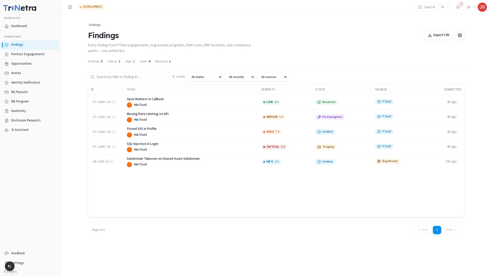
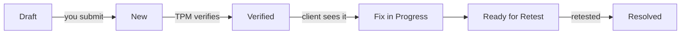

# Findings

### 1. Findings are your deliverable

A **finding** is a documented vulnerability you discover. As a researcher, findings are your primary deliverable and what drives payout eligibility. You author findings within an engagement (or bug bounty program), provide clear proof-of-concept evidence, and submit them for TPM verification.

> **Note:** Findings are created directly from within the target engagement or bug bounty program page, ensuring your submission is automatically linked to the correct scope.

---

### 2. What a researcher can do

| Action | Researcher | Lead Researcher | TPM / Staff |
|--------|:---:|:---:|:---:|
| Submit new findings on assigned engagements | ✅ | ✅ | ✅ |
| Edit your own finding while in Draft or New state | ✅ | ✅ | ✅ |
| Delete unsubmitted draft findings | ✅ | ✅ | ✅ |
| View findings on your engagements | ✅ | ✅ | ✅ |
| Verify findings, change status, or override official severity | ❌ | ❌ | ✅ (TPM) |

### Navigation

Click **Findings** in the main sidebar menu to browse all findings across your assigned engagements. To see only your own submissions, use the **My Findings** filter or view within an engagement's **Findings** tab.

---

### 3. Your personal findings tracker

The findings list shows all findings on engagements you're assigned to. Filter or search to focus on your own submissions. For each finding, track:

| Column | Why it matters to you |
|--------|-----------------------|
| **Title** | Short summary of the vulnerability. Click to open the full detail. |
| **Severity + CVSS** | Your proposed rating (the TPM may adjust it at triage). |
| **State** | Where it is in the pipeline (see below). |
| **Source** | Which engagement/program it came from. |
| **Created** | When you filed it. |

---

### 4. Submitting a finding — Form structure & fields

When you click **Submit finding**, a structured form opens with seven dedicated cards:

#### 1. Title & Classification
- **Title**: Short, specific summary (e.g. *"Stored XSS in User Profile Bio"*).
- **Asset Type**: Defines target surface (Web Application, API & Web Services, Mobile iOS, Mobile Android, Cloud Infrastructure, External/Internal Network, Source Code, AI/LLM Model).
- **Vulnerability Type (OWASP)**: Select from context-aware OWASP categories (OWASP Top 10 2021, OWASP API Top 10 2023, OWASP Mobile 2024, or specify *Other*).
- **VRT Category (Bugcrowd Taxonomy)**: Required taxonomy classification; selecting a category automatically pre-fills the standard CWE ID.
- **CWE / CVE / MITRE ATT&CK**: Standard identifiers (e.g. CWE-79, CVE-2026-1234, T1059.004).
- **Tool Used & Environment Details**: Optional fields for scanner tool name or OS/browser context.

#### 2. Severity & CVSS v4.0
- **CVSS v4.0 Calculator**: Complete all 11 CVSS v4.0 metrics (Attack Vector, Complexity, Requirements, Privileges, User Interaction, VC/VI/VA, SC/SI/SA).
- **Severity Rating**: Derived automatically from the calculated CVSS v4.0 score (Critical, High, Medium, Low, Informational) and locked.

#### 3. Writeup (Rich Text + Media Attachments)
- **Background**: Contextual explanation of the vulnerability class.
- **Description**: Detailed explanation of the flaw in the target application.
- **Steps to Reproduce**: Numbered, step-by-step reproduction instructions.
- **Impact**: Business risk framed clearly for the customer.
- **Remediation**: Recommended fix and patching guidance.
- **Attachments**: Drag-and-drop screenshots or PoC files directly into rich text editors.

#### 4. CIA Triad Impact
- Select impact level (**None**, **Low**, **High**) and provide a description for **Confidentiality**, **Integrity**, and **Availability**.

#### 5. OWASP Risk Rating (Report Heat Matrix)
- **Likelihood (0–9)** & **Impact (0–9)**: Scores that position the finding on Section 7 of the executive report's Risk Heat Matrix.

#### 6. References
- One or more reference URLs (e.g. vendor advisories, OWASP guides).

#### 7. Endpoint Details (Required for Web, API, Mobile)
- **HTTP Method**: GET, POST, PUT, DELETE, PATCH, etc.
- **Endpoint URL / Path**: Exact vulnerable URL target.
- **Affected Parameter**: Specific parameter or header name.
- **Raw Request & HTTP Request/Response**: Paste full HTTP requests and responses for immediate triage verification.

---

### 5. Finding lifecycle states

| State | Meaning for the researcher |
|-------|----------------------------|
| **Draft** | Saved locally or as a draft record; full editing allowed. |
| **New** | Submitted for TPM verification; editable by author until triaged. |
| **Verified** | Confirmed valid by TPM; visible to client. This is the milestone that makes it count. |
| **Fix in progress / Ready for retest** | Client is remediating; you may be asked to retest. |
| **Resolved** | Closed — typically the trigger for payout eligibility. |
| **Duplicate / Rejected** | Not counted — check the comments for why. |

---

### 6. From finding to payout

A finding that reaches **Verified/Resolved** on a paid program or engagement becomes eligible for a **payout**. Track the money side under [Payouts](09-payouts.md).

---

### Best practices

- **Provide clear HTTP requests/responses** — raw request logs speed up TPM verification.
- **Complete all 11 CVSS metrics** — ensuring accurate score derivation prevents triage delays.
- **Check for duplicates** — search existing engagement findings before filing to avoid duplicate rejections.
- **Chase your NEW items** politely via comments if verification stalls.
- **Learn from adjustments** — if the TPM re-scores or bounces a finding, the history tells you how to write a stronger one next time.

### Troubleshooting

| Symptom | Cause / Fix |
|---------|-------------|
| **Submit finding drawer won't open** | Verify the engagement status is active (Live). |
| **Server validation error on submit** | Check minimum character length requirements for writeup and impact fields. |
| **Severity field disabled** | Intentional; severity is derived automatically from the 11 CVSS v4.0 metrics. |
| **My finding is stuck at New** | Awaiting TPM verification — ping via comments if it's been a while. |
| **Marked duplicate** | Someone reported it first; check the linked original in the comments. |
| **No payout yet** | Payout usually follows Verified/Resolved + any hold period — see Payouts. |

---

← Previous: [Engagements](06-engagements.md) | Next: [Payouts →](09-payouts.md)
