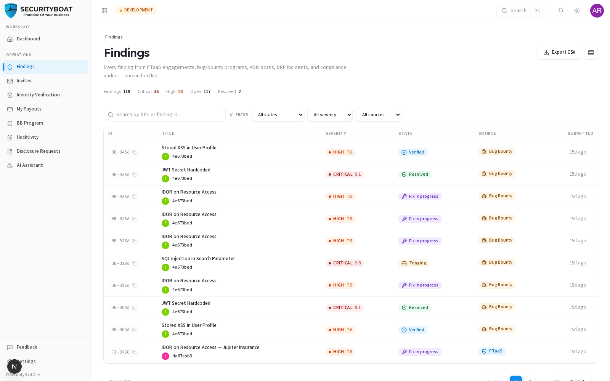

## 7. Findings

### 7.0 Findings are your deliverable

A **finding** is a documented vulnerability you discover. As a researcher, findings
are what you produce and get paid for. You **create** them on an engagement (or bug
bounty program), write them up clearly, and submit them for the TPM to verify.

> **Scope:** you see findings on the engagements you're on, plus your own
> submissions. You **create** findings; you don't verify them (that's the TPM).

### 7.1 What a researcher can do

| Action | Researcher |
|--------|:---:|
| Create / submit a finding (on your engagement) | ✅ |
| Edit your own finding while it's a DRAFT | ✅ |
| Archive your own unsubmitted DRAFT/NEW | ✅ |
| View findings on your engagements | ✅ |
| Verify a finding / change severity officially | ❌ (TPM) |

### Navigation

Click **Findings** in the main sidebar menu to see the list, or submit from an
engagement's **Findings** tab.

---

### 7.2 Submitting a finding

Findings are created **from the engagement** (so the source binding can't be
forged). On your engagement's **Findings** tab, use **Submit finding** and fill in
the record:

| Field | Type | Required | Notes |
|-------|------|:---:|-------|
| **Title** | Text | ✅ | Short, specific ("Stored XSS in profile bio"). |
| **Severity** | Enum | ✅ | Critical / High / Medium / Low / Informational (your proposed rating). |
| **CVSS** | Score + vector | ✅ | **CVSS v4.0** vector + score. |
| **Vulnerability type** | Text | ✅ | The class (e.g. "SQL Injection"). |
| **CWE / CVE** | IDs | — | Where applicable. |
| **Endpoint / URL** | Text | ✅ | Exactly where it was found. |
| **Description** | Rich text | ✅ | What the issue is. |
| **Impact** | Rich text | ✅ | What an attacker achieves — the business risk. |
| **Remediation** | Rich text | ✅ | How to fix it. |
| **Evidence** | Attachments | ✅ | Screenshots, request/response, PoC steps. |

It starts as **Draft** (you can keep editing), then you submit it (→ **New**) for
the TPM to verify.

### 7.3 The list & detail




The list has KPI tallies, filters, and columns for tracking findings.
Open a finding to see its full record, comments (coordinate with the TPM), and state
history.

### 7.4 What happens after you submit

```
Draft (you edit) → New (submitted) → TPM verifies → Verified (client sees it)
     → client remediates → Ready for Retest → you/TPM retest → Resolved
```

If the TPM sends it back or adjusts severity, you'll see it in the comments/history.
A verified, resolved finding is what drives your **payout** (see the Payouts guide).

### Best practices

- **Write for the client** — clear repro steps, real impact, actionable remediation.
  A vague finding gets bounced; a crisp one gets verified fast.
- **Attach solid evidence** — screenshots and request/response captures.
- **Score honestly** with CVSS v4.0 — inflated severity slows verification.
- **Check for duplicates** before submitting.

### Troubleshooting

| Symptom | Cause / Fix |
|---------|-------------|
| **No Submit finding action** | The engagement isn't in a testing state, or you're not on its team. |
| **Can't edit after submitting** | Once past Draft, content edits are limited — coordinate via comments/the TPM. |
| **Severity was changed** | The TPM re-scored it at triage; the reason is in the history. |

---

← Previous: [Engagements](06-engagements.md) | Next: [My Findings →](08-my-findings.md)
