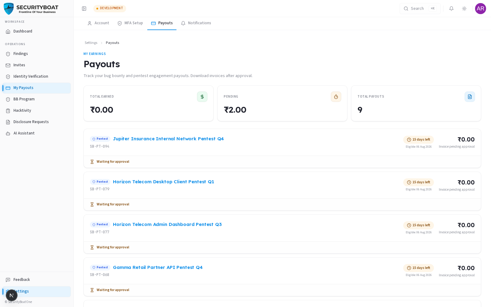
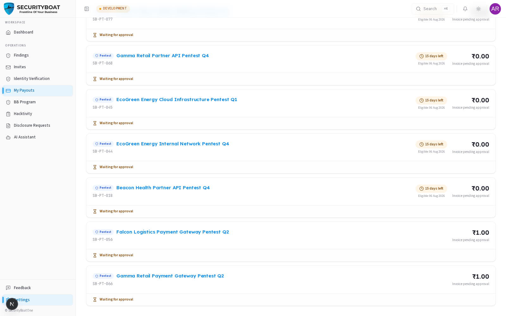

## Payouts

### 1. Where you get paid

**Payouts** is your earnings dashboard. It aggregates money from **both** revenue
streams — **Bug Bounty** (per accepted finding) and **Pentest engagements** (per
completed engagement) — and tracks each payment from pending through paid, with
downloadable invoices.

### Navigation

**My Payouts** in the sidebar or in Account Setting .

---

### 2. Earnings summary





Three tiles at the top:

| Tile | Meaning |
|------|---------|
| **Total Earned** | Sum of everything marked **Paid**. |
| **Pending** | Sum of everything approved/awaiting that isn't rejected. |
| **Total Payouts** | Count of payout records. |

### 3. The payout list

Each payout card shows:

| Element | Meaning |
|---------|---------|
| **Source badge** | **Bug Bounty** (a finding) or **Pentest** (an engagement). |
| **Title / ID** | The finding or engagement it's for. |
| **Amount** | Payout amount + currency. |
| **Status** | Waiting for approval → Approved (payment pending) → **Paid** (or Rejected). |
| **Days left / Eligible date** | Any hold period before the payout becomes eligible. |
| **Invoice** | A downloadable invoice link once available. |

**When can you download an invoice?**

| Source | Invoice available when… |
|--------|-------------------------|
| **Pentest** | Status is **Paid** and an invoice number exists. |
| **Bug Bounty** | Status is **Approved or Paid** and an invoice number exists. |

### 4. The payout lifecycle

```
Finding verified / engagement complete  →  payout created (Pending)
   →  (hold period counts down)  →  Approved  →  Paid  →  invoice downloadable
```

> **Get paid faster:** payouts depend on your **bank details** and identity
> **verification** being complete. Fill in bank details in Settings → Account and
> finish [Identity Verification](10-verification.md) so nothing blocks a payment.

### Best practices

- **Complete verification + bank details early** — they gate payments.
- **Download invoices** for your own records/taxes as soon as they're available.
- **Watch the hold period** — the "days left" tells you when a payout becomes
  eligible.

### Troubleshooting

| Symptom | Cause / Fix |
|---------|-------------|
| **"No payouts yet"** | No verified/accepted findings or completed engagements yet. |
| **Invoice not downloadable** | The payout isn't in an invoice-eligible state yet (see §9.2). |
| **Payout stuck pending** | It may be in its hold period, or awaiting approval — check the status and eligible date. |

---

← Previous: [My Findings](08-my-findings.md) | Next: [Identity Verification →](10-verification.md)
