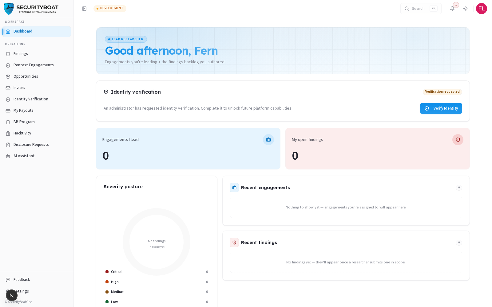
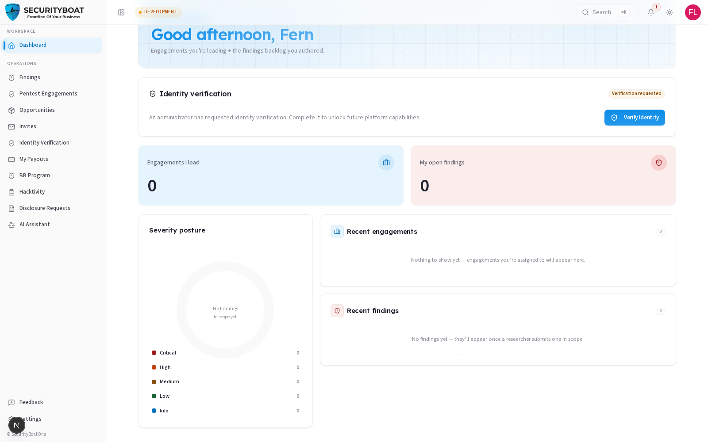
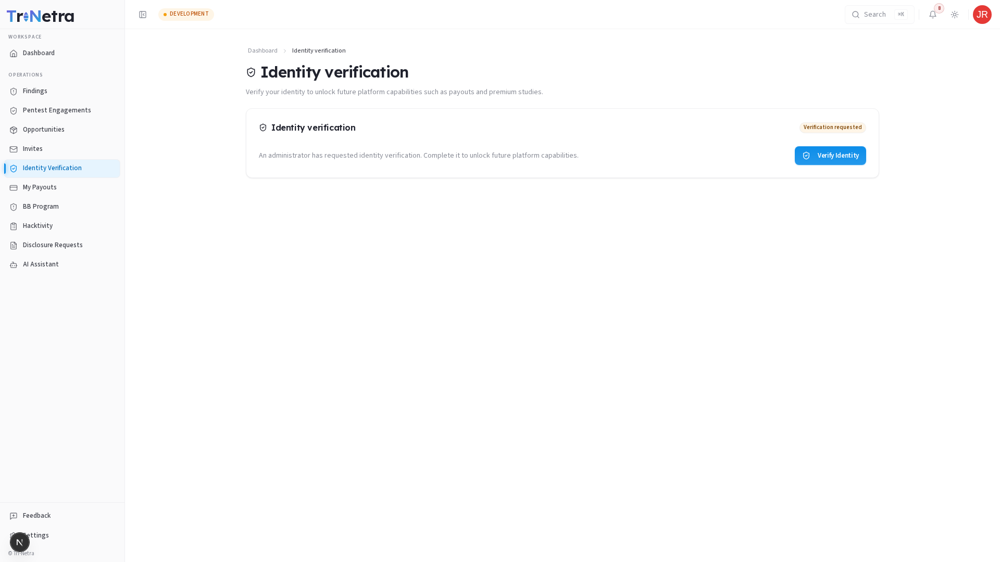
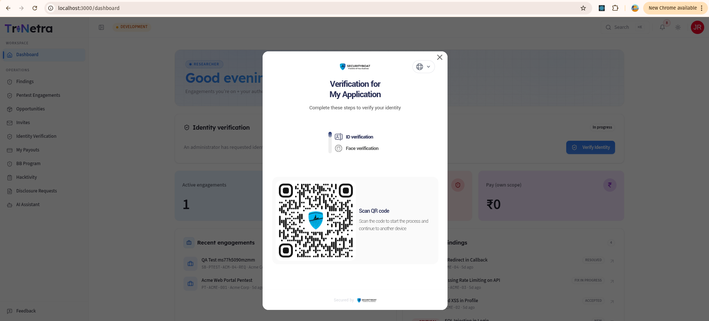
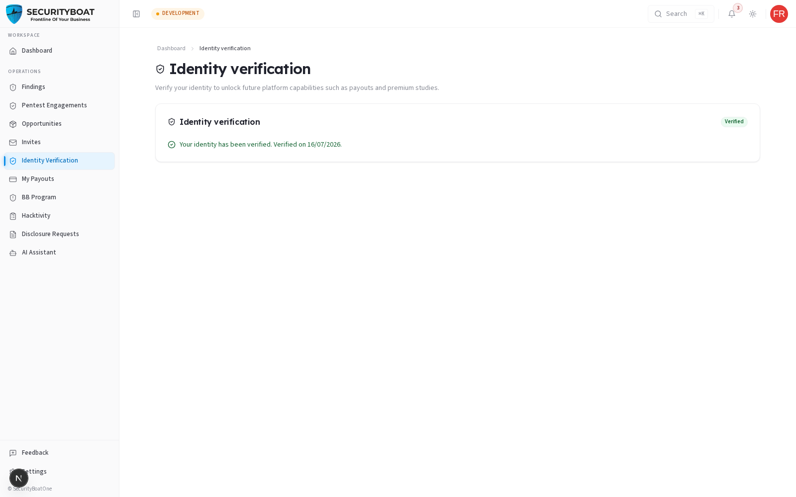

## 10. Identity Verification

### 10.0 What it is and why it exists

**Identity verification** confirms you are a real, named person before SecurityBoat
entrusts you with sensitive work and payments. It is an **admin-initiated** check:
a SecurityBoat administrator requests it against your researcher profile, you
complete a short document + face-match flow on your phone, and — once it passes —
your profile shows a **Verified** status to both you and SecurityBoat staff.

Verification is what **unlocks platform capabilities such as payouts and premium
work opportunities**. You cannot start it yourself out of the blue; it becomes
available after an administrator requests it.

**Data privacy & security:** Verification is powered by SecurityBoat's identity
provider, which performs the actual **ID-document check** and **face match**.
SecurityBoat never sees or stores your raw documents — it receives only the
provider's structured result (document type, name, date of birth, a masked document
number, face-match score, and the decision).

---

### 10.1 Verification process at a glance

```
ADMIN (SecurityBoat)                         YOU (researcher)
────────────────────                         ─────────────────
Requests identity verification  ──▶  You receive a notification +
                                    a "Verify Identity" button appears
                                    on your Dashboard and Verification page
                                            │
                                            ▼ Click "Verify Identity"
                                    A popup opens showing steps & QR code
                                            │
                                            ▼ Scan QR code on your phone
                                    On phone: choose ID type (passport,
                                    driving licence, national ID card)
                                    → photograph document → face match
                                            │
                                            ▼ Complete mobile flow
Status updates: Approved /          Outcome reconciled automatically;
Pending Review / Declined    ◀──    Verified status updates on profile
```

**Verification statuses you may experience:**
- **Not Requested**: Initial state before an admin requests verification.
- **Requested**: Verification has been requested by staff and a prompt is available.
- **In Progress**: You have opened the flow and are uploading documents or completing face match on your phone.
- **Under Review**: Verification completed and awaiting administrator sign-off.
- **Verified**: Verification successful. "Verified" status active on your profile.
- **Resubmission Required**: Staff requested you re-run the verification process with clearer inputs.
- **Declined**: Verification check was rejected.
- **Expired / Incomplete**: Session timed out or was closed before finishing.

---

### 10.2 Receiving the prompt

As soon as an administrator requests your verification, two things happen:

1. You receive a **notification** (bell icon + email).
2. An **Identity verification** prompt appears in two places — on your **Dashboard**
   and on the dedicated **Identity Verification** page — each with a **Verification
   requested** badge and a **Verify Identity** button.

**On your Dashboard:**





**On the Identity Verification page** (sidebar → **Identity Verification**):



---

### 10.3 Starting the check — the verification popup

Click **Verify Identity** (on either surface). SecurityBoat creates a secure
verification session and opens a **popup** titled *"Verification for My Application —
Complete these steps to verify your identity."* It lists the required steps and
displays a **QR code**; the badge status switches to **In progress**.



The verification process consists of two primary steps:

| Step | What happens |
|------|--------------|
| **ID verification** | You present an official government ID; the provider reads and validates it. |
| **Face verification** | You take a live selfie; the provider matches your live selfie to the ID photo. |

**Why a QR code?** Document capture and liveness checks work best on a mobile camera.
Scanning the QR code hands the session off to your mobile browser while keeping your
desktop session active waiting for the result.

---

### 10.4 Completing the check on your phone

1. **Scan the QR code** using your phone's camera app to open the secure verification flow in your mobile browser.
2. **Choose your ID type** — select your government-issued document type (e.g., **passport, driving licence, national ID card**).
3. **Capture your document** — follow on-screen prompts to photograph your document clearly.
4. **Complete face match** — take a live selfie so the system can verify your liveness and compare against your ID photo.
5. Upon successful completion, the mobile interface reports **success** and the popup automatically closes.

SecurityBoat reconciles the signed outcome from the identity provider. Your status updates automatically to **Verified** or moves to **Under Review** if administrator review is required.

---

### 10.5 The verified state and status handling

#### Verified State
Once approved, your **Identity verification** card displays a green **Verified** indicator (with approval date), and the **Verify Identity** button is removed. Staff can see your verified status on your profile.



#### Handling Non-Passing Statuses

| Status you see | What it means | Action to take |
|----------------|---------------|----------------|
| **Verification was declined** | The verification check was rejected. | Review the reason, ensure you use your own valid document, and click **Verify Identity** to try again. |
| **Additional information required** | Administrator requested a fresh submission with better quality inputs. | Click **Verify Identity** to re-run the verification flow. |
| **Verification did not complete** | Session timed out or was closed prior to completion. | Click **Verify Identity** to initiate a new verification session when ready. |

---

### 10.6 Best practices & troubleshooting

#### Best Practices

- **Prepare documents and mobile device** before clicking **Verify Identity** to prevent session timeouts.
- **Use valid, non-expired identification.** Ensure the ID belongs to you; face matching compares your live selfie against the ID photograph.
- **Ensure good lighting and avoid glare.** Clear document images and well-lit selfie captures reduce verification failures.
- **Complete verification promptly** to unlock payouts and premium engagement opportunities without delay.

#### Troubleshooting

| Symptom | Cause / Fix |
|---------|-------------|
| **No "Verify Identity" button available** | Verification has not yet been requested by an administrator. Verification is admin-initiated; the button appears once requested. |
| **"Could not start verification" error** | Session creation failed. Close the popup and click **Verify Identity** again. If issues persist, contact support. |
| **QR code will not scan** | Increase screen brightness and use native phone camera app. Keep the desktop browser window open. |
| **Completed mobile flow but status did not update** | Results reconcile automatically; refresh the page after a few moments. |
| **Declined despite correct documentation** | Verify that your ID is in date and your selfie was clear and unobscured. Click **Verify Identity** to retry or contact support. |

---

← Previous: [Payouts](09-payouts.md) | Next: [Bug Bounty →](11-bug-bounty.md)
