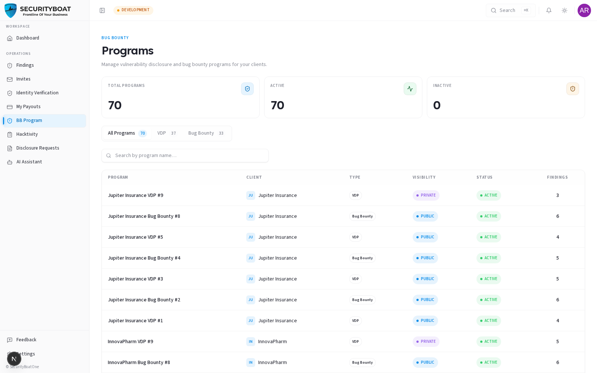
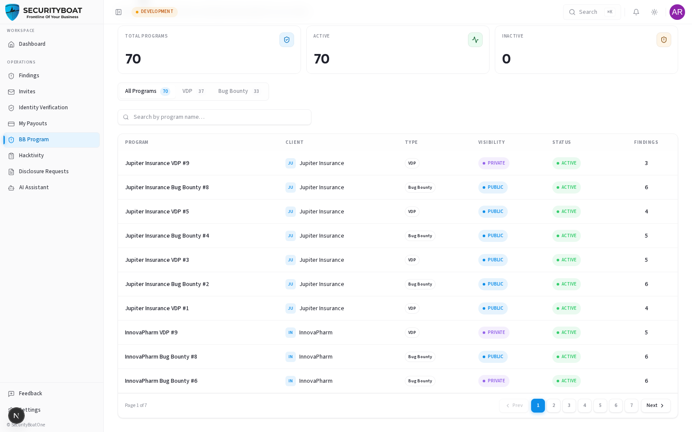

## 11. Bug Bounty

### 11.0 Bug Bounty for researchers

**Bug Bounty** is the continuous, rewarded testing side of the platform. As a
researcher you browse programs, test in-scope assets, and submit findings — earning
per valid finding (tracked in [Payouts](09-payouts.md)). It complements pentest
engagements: bug bounty is open-ended and self-directed, engagements are scheduled
and team-based.

### Navigation

Sidebar: **BB Program**, **Hacktivity**, **Disclosure Requests**.

---

### 11.1 Programs

The programs list shows each program's **type** (VDP or Bug Bounty), **visibility**
(Public/Private), **status** (Active/Inactive/Closed), and findings count. Open a
program to read its **policy and scope** — what's in bounds, what's out, and the
reward structure — before you start testing.

> You participate in **Public** programs freely; **Private** programs are
> invite-only (watch your [Invites](05-invites.md)).

### 11.2 Submitting bug-bounty findings

Findings you submit against a program flow into the unified **Findings** module
(source = `Bug Bounty`) and follow the same lifecycle: submit → TPM/triage verifies
→ (client) remediates → resolved → payout. Write-up quality matters just as much as
on an engagement — see the [Findings guide](07-findings.md).

### 11.3 Hacktivity & Disclosure Requests

- **Hacktivity** — the public feed of disclosed/resolved reports across programs.
  Good for seeing what's being found and building your reputation.
- **Disclosure Requests** — when your finding is fixed, you can request permission
  to publish a sanitised write-up; it's reviewed before anything goes public.

### Best practices

- **Read the program scope carefully** — out-of-scope submissions won't be rewarded.
- **Check Hacktivity** to avoid re-reporting known issues.
- **Request disclosure** on resolved findings to build a public track record.

### Troubleshooting

| Symptom | Cause / Fix |
|---------|-------------|
| **Can't access a program** | It may be Private (invite-only) or closed. |
| **Submission not rewarded** | It was out of scope, a duplicate, or not verified — check the finding's comments. |

---

← Previous: [Identity Verification](10-verification.md) | Next: [AI Assistant →](12-ai-assistant.md)
