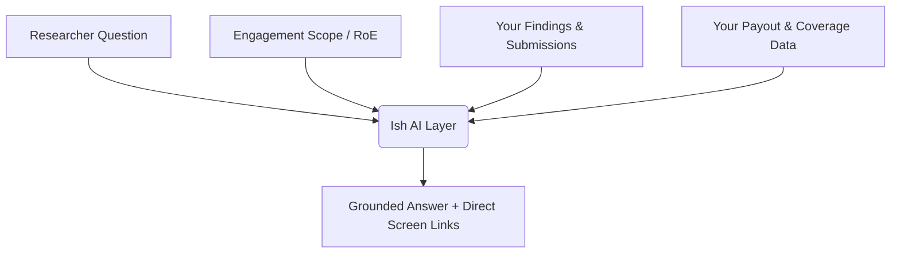
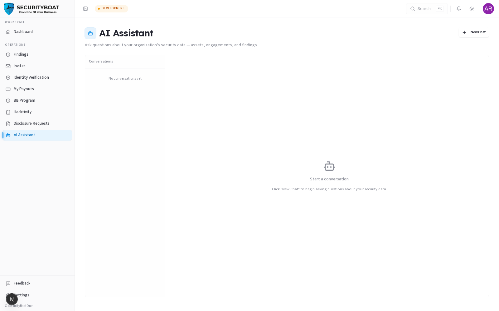

# AI Assistant (Ish)

> **Security Researcher Guide** · Researcher · Lead Researcher

The **AI Assistant** (powered by **Ish** / **Ask Ish**, TriNetra's agentic AI assistant layer) is a conversational assistant built into the researcher portal. Unlike generic AI chatbots, Ish is grounded in live platform data and strictly scoped to the engagements, findings, and bug bounty programs you participate in.

---

## 1. What Ish is for Researchers

As a researcher, managing multiple engagements, tracking finding triage, and verifying testing coverage can require switching between multiple views. 

Ish provides an instant, plain-language interface to help you:
* Track the review status of your submitted vulnerabilities.
* Rapidly review engagement scope, target endpoints, and Rules of Engagement (RoE).
* Identify untested methodology items on engagement coverage checklists.
* Check payout clearances and hold period statuses.

---

## 2. Access & Security Boundaries

### Access Modes
* **Sidebar Navigation:** Click **AI Assistant** in the main sidebar to open the dedicated conversational interface for multi-turn queries and history.
* **Contextual Widget:** Click the floating **Ask Ish** widget on any engagement or finding screen to ask questions relevant to your active view.

### Security & Privacy Boundaries
* **Strict Personal Scoping:** Ish strictly isolates researcher data. You can only query findings you authored, engagements you are seated on, and your own payouts. You can never see other researchers' earnings or private submissions.
* **Confidentiality:** Queries and context are processed within TriNetra's secure tenant boundary and are never used to train public LLM models.
* **Model Transparency:** Every answer displays a **Model Badge** and **Token Count** to provide full visibility into the underlying model.

---

## 3. Example Queries for Researchers

### Finding Triage & Verification
* *"Which of my submitted findings are currently in TPM Review?"*
* *"Show me all drafts I have saved across active engagements."*
* *"Have any of my findings been marked as 'Needs More Info' by the triage team?"*

### Engagement Scope & Rules of Engagement
* *"Summarise the in-scope assets and testing windows for Engagement #104."*
* *"Are subdomains outside of `*.api.example.com` in scope for this bug bounty program?"*
* *"What are the prohibited testing techniques listed in the engagement brief?"*

### Methodology & Coverage Checklists
* *"What items on the Web Application checklist for my current engagement are still marked untested?"*
* *"Summarise the overall coverage progress for the API security section."*

### Payouts & Compensation
* *"Which of my verified findings have cleared the hold period and are eligible for payout?"*
* *"What is my total pending payout amount for this month?"*

---

## 4. Best Practices & Operational Security

- **OpSec & Data Safety:** Never paste production passwords, live session tokens, customer PII, or raw weaponized exploit payloads into the chat.
- **Scope Verification:** Use Ish as a quick scope reference, but always double-check the official **Brief** tab for legally binding engagement constraints.
- **Direct Action:** Follow the deep links provided by Ish to open finding cards, retest workflows, or payout invoice screens.

---

## 5. Troubleshooting

| Symptom | Probable Cause | Recommended Fix |
|---|---|---|
| **"I cannot find that engagement/finding"** | The item is outside your assigned engagements or has not been authored by you. | Confirm you are seated on the engagement in your **Pentest Engagements** list. |
| **Response seems outdated** | Status changed in another tab (e.g. finding verified by TPM). | Ask Ish to re-query the latest status or open the **Findings** tab directly. |
| **Model returns unexpected response** | Complex question with ambiguous scope. | Specify the exact Engagement Title or Finding ID in your query. |

---

← Previous: [AI Red Teaming](15-ai-red-teaming.md) | Next: [Feedback →](18-feedback.md)
