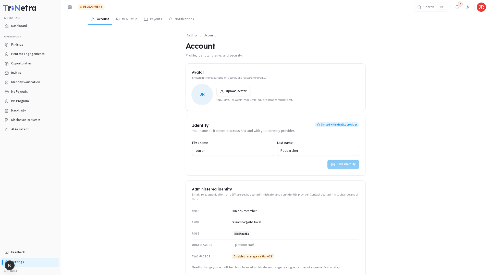
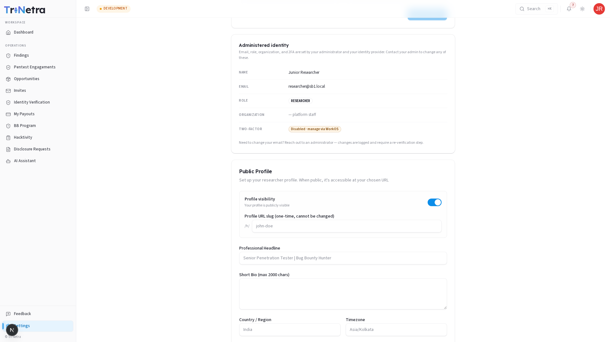
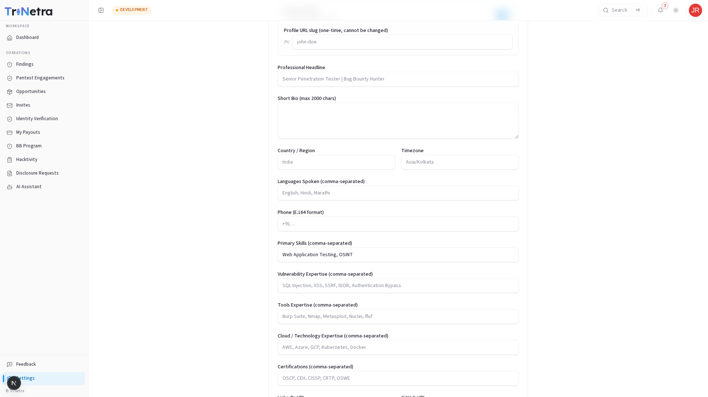
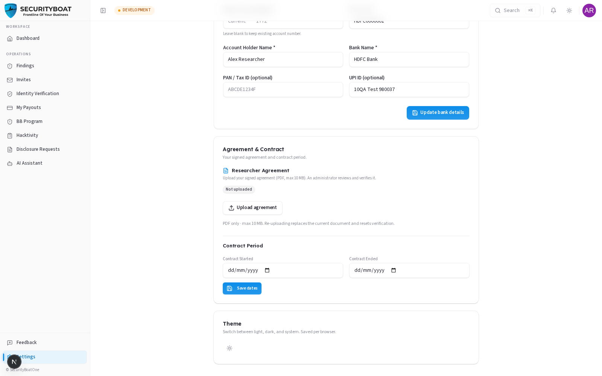
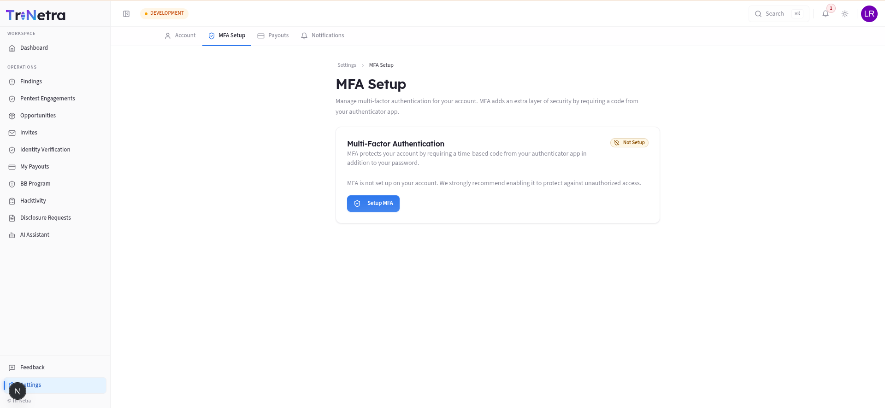

# Settings

### 1. Overview

**Settings** is your personal account area. For researchers it has more than other
roles because it holds the **payment and contract** details needed to work and get
paid. Tabs: **Account**, **MFA Setup**, **Payouts**, **Notifications**.

### Navigation

Click **Settings** (bottom of the sidebar) → opens on **Account**.

---

### 2. Account (researcher-specific)

| Section | What you can do |
|---------|-----------------|
| **Avatar** | Upload a photo — shown on your public researcher profile. |
| **Identity (name)** | Edit your first/last name. |
| **Administered identity** | **Read-only** — email, role, and 2FA status (managed by administrator). |
| **Professional profile** *(researchers)* | Bio, phone, LinkedIn/GitHub/website, **skills** and **certifications** — these power your public profile and the Pentesters directory. |
| **Bank details** *(researchers)* | Your payout account. **Sensitive fields are encrypted** (e.g. account number and IFSC code). Required to receive payments. |
| **Agreement & Contract** *(researchers)* | Your signed agreement upload and contract period. |
| **Theme** | Light / Dark / System (saved per browser). |

> **The three things that unblock payouts:** complete **bank details**, finish
> **identity verification** (see the Verification guide), and have an active
> agreement/contract. Do these early.

---

### 3. MFA Setup

Manage multi-factor authentication (MFA) to secure your account. Because your profile carries sensitive findings, signed contracts, and bank payout details, maintaining active MFA is highly recommended.

#### How to Enroll in MFA
1. **Open Setup**: Navigate to **Settings → MFA Setup** and click **Setup MFA**.
2. **Scan QR Code**: Open your preferred authenticator app (e.g., Google Authenticator, Authy, Microsoft Authenticator, or 1Password) and scan the displayed QR code. If your device cannot scan the code, click **Show** to reveal the secret key and enter it manually.
3. **Save/Copy Key**: You can also click the copy icon to securely copy the configuration key to your clipboard.
4. **Complete Enrollment**: Once you have scanned or entered the code into your authenticator app, click the **Done — I've added it to my app** button. The app will confirm your enrollment, and you will be prompted for your MFA verification code during your next login attempt.

#### Disabling or Resetting MFA
If you currently have MFA enabled and need to re-key or disable it:
1. Navigate to **Settings → MFA Setup**.
2. Click the red **Reset MFA** button.
3. Confirming this action removes all active MFA factors from your account immediately. You can now log in using only your email and password, or begin the enrollment flow again.

#### Recovery & Lost Authenticator Access
If you lose access to your authenticator app, you can reset your MFA using the self-service flow:
*   **Request recovery**: Click the **Reset MFA** link on the login page, enter your registered email, and follow the link sent to your inbox.
*   **Administrative assistance**: If you cannot access your email, contact the SecurityBoat support team to verify your identity and manually reset your MFA settings from the administration panel.

---

### 4. Payouts

The **Payouts** tab is your earnings dashboard — see the dedicated
[Payouts guide](09-payouts.md).

---

### 5. Notifications

Choose which notifications reach you and how. Keep invite/finding/payout
notifications on so you don't miss opportunities, verification requests, or payment
updates. Critical security alerts may bypass these settings.

---

### Best practices

- **Complete bank details + verification first** — nothing pays out without them.
- **Keep skills/certifications current** — they drive marketplace matches and your
  public profile.
- **Enable MFA.**

---

### Troubleshooting

| Symptom | Cause / Fix |
|---------|-------------|
| **Payout blocked** | Bank details incomplete or identity not verified — finish both. |
| **Can't edit email/role** | Admin/IdP-managed by design. |
| **Profile not on the directory** | Ensure your profile is complete and public. |

---

← Previous: [Feedback](18-feedback.md) | Back to [Researcher Guide index](RESEARCHER_Guide.md)

