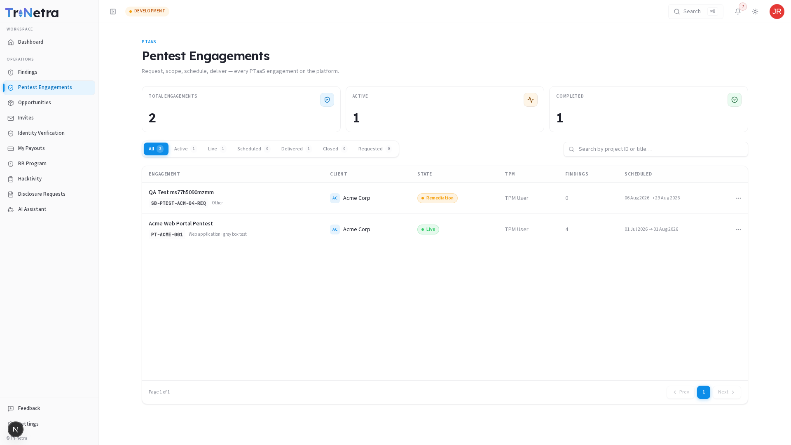

# Agentic Pentest (Researcher View)

---

Agentic Pentest is TriNetra's AI-driven penetration testing module. As a researcher, you direct and validate the output of coordinated AI agents that run reconnaissance and exploit-chaining around the clock.

---

## How It Works

Attackers are already using AI to recon faster, chain exploits automatically, and abuse business logic at a scale no human red team can match. Agentic Pentest meets that speed head-on — a swarm of coordinated AI agents runs reconnaissance and exploit-chaining, while certified human testers (you) direct, validate, and sign off on every single finding.

### Attacker-Speed Coverage

Machine-speed recon, mass endpoint/parameter discovery, and agentic exploit-chaining — the same techniques an AI-augmented adversary would run against your targets, run continuously in your favor instead.

### AI-Native Engineering Resilience

Your own AI-assisted dev pipeline is new attack surface — agents specifically probe for the weaknesses that fast, AI-generated code and agentic workflows tend to introduce, before an attacker's agents find them first.

---

## Engagement Tiers

| Tier | Duration | Scope |
|---|---|---|
| Gap Assessment | 2 weeks | Quick triage of critical surfaces |
| Focused Cycle | 4 weeks | Deep-dive on a single system or application |
| Multi-System | 8 weeks | Coordinated testing across multiple interconnected services |
| Full-Stack | 12 weeks | End-to-end assessment covering all layers |

---

## Interface Tabs

### Live Recon

The **Live Recon** tab shows real-time agent activity:

- **Agent Discovery Feed** — a stream of findings as agents discover them
- **Cadence Comparison** — charts comparing agent-driven testing velocity against human-only testing
- **Agent vs Human Testing Volume** — side-by-side metrics showing coverage depth

### Human Review Queue

Findings surfaced by AI agents appear here for your review. Each entry requires:

1. Review the agent's evidence (screenshots, request/response pairs, reproduction steps)
2. Validate the finding — confirm it's exploitable and not a false positive
3. Assign a severity rating
4. Sign off to promote the finding to the client-visible queue

Nothing ships to a client without a human signature.

### Sign-Off Log

A full audit trail of every finding that was reviewed, validated, and signed off — including who reviewed it and when.

---

## Researcher Responsibilities

- Monitor the **Live Recon** feed for emerging critical findings
- Clear the **Human Review Queue** promptly — client SLAs depend on your turnaround
- Validate agent findings thoroughly before signing off
- Escalate false positives or edge cases through the **Feedback** module

---

← Previous: [Disclosure Requests](16-disclosure-requests.md) | Next: [AI Red Teaming →](15-ai-red-teaming.md)

