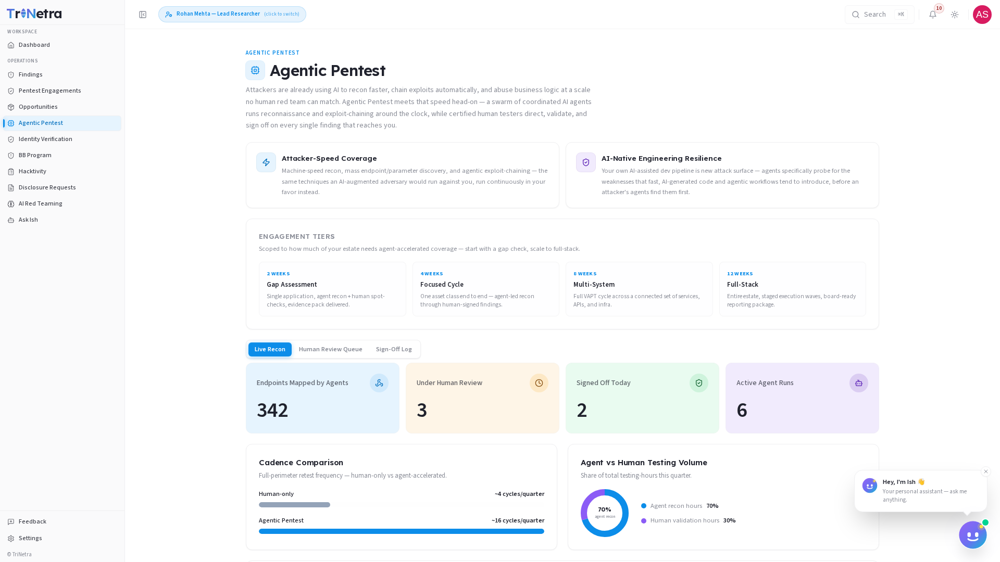
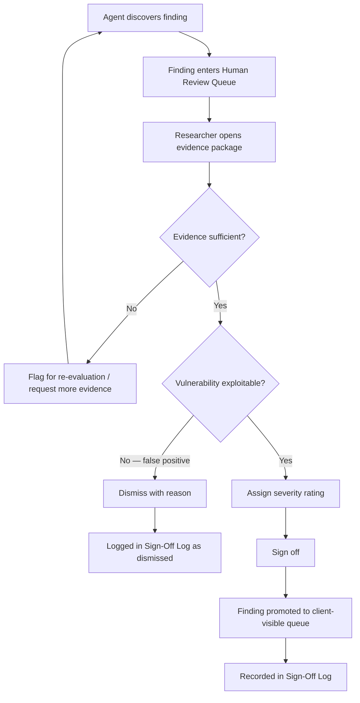

# Agentic Pentest

### 1. The researcher's role in Agentic Pentest

Agentic Pentest is TriNetra's AI-driven penetration testing module. A swarm of coordinated AI agents runs reconnaissance and exploit-chaining around the clock — but **you** are the director, validator, and gatekeeper. Agents surface potential findings; you review their evidence, confirm exploitability, assign severity, and sign off before anything reaches the client.

> **Core principle:** Agents propose, researchers confirm. The human-in-the-loop is mandatory. You are the last line of defence against false positives, and no finding ships to a client without your signature.

Your daily workflow centres on three tasks: monitoring the **Live Recon** feed for emerging critical activity, working through the **Human Review Queue** to validate and sign off agent findings, and checking the **Sign-Off Log** to maintain a complete audit trail of your decisions.

---

### 2. What a researcher can do

| Capability | Researcher | Lead Researcher |
|------------|:---:|:---:|
| Monitor the Live Recon feed | ✅ | ✅ |
| Clear the Human Review Queue — review, validate, and sign off agent findings | ✅ | ✅ |
| Assign severity ratings to validated findings | ✅ | ✅ |
| View the Sign-Off Log audit trail | ✅ | ✅ |
| Assign review queue items to specific researchers | ❌ | ✅ |
| View team sign-off velocity and throughput metrics | ❌ | ✅ |

---

### Navigation

In the researcher sidebar, Agentic Pentest is located under **OPERATIONS**. Select it to enter the module.

---

### 3. The Live Recon Tab

The **Live Recon** tab provides a real-time dashboard of agent activity and discovery throughput. It is your situational awareness centre — check it at the start of every shift and periodically throughout the day.

#### Metrics at a glance

| Metric | What it tells you |
|--------|-------------------|
| **Endpoints Mapped by Agents** | Total unique endpoints discovered and catalogued by the agent swarm |
| **Under Human Review** | Findings currently sitting in the queue awaiting researcher validation |
| **Signed Off Today** | Findings validated and promoted to client-visible queue in the current 24-hour window |
| **Active Agent Runs** | Number of agent reconnaissance or exploit-chaining runs executing right now |

#### Cadence Comparison

This chart compares agent-driven testing velocity against human-only testing cadence. A typical human-only pentest achieves approximately **4 testing cycles per quarter**; Agentic Pentest delivers around **16 cycles per quarter** — four times the coverage density over the same period.

> **Why this matters:** Attackers are already using AI to recon faster and chain exploits automatically. Cadence parity ensures your targets are tested at attacker speed, not at calendar-constrained human speed.

#### Agent vs Human Testing Volume

The volume breakdown visualises how the total testing effort is distributed: roughly **70% agent-driven reconnaissance** (mass endpoint discovery, parameter fuzzing, automated exploit-chaining) and **30% human validation** (your review, severity assessment, and sign-off). This split reflects the module's design philosophy — let machines do the high-volume scanning so you can focus on high-value decisions.

#### Agent Discovery Feed

A **live, scrolling feed** of agent discoveries as they happen. Each entry shows the target endpoint, the finding type, a confidence score, and a timestamp. Critical or high-confidence findings are flagged for prioritisation. Click any entry to open the full agent evidence package and fast-track it into your review workflow.

---

### 4. The Human Review Queue

The **Human Review Queue** is your primary workspace. Every finding surfaced by the AI agent swarm lands here, and every finding that reaches a client passes through this queue — with your signature on it.

#### Step-by-step review workflow

1. **Open the finding.** Click an entry in the queue to expand the full agent evidence package.
2. **Review agent evidence.** Examine the provided materials:
   - Screenshots and screen recordings of the exploit in action
   - Raw request/response pairs demonstrating the vulnerability
   - Reproduction steps the agent followed to trigger the finding
   - Any automated severity scoring the agent assigned
3. **Validate the finding.** Confirm that the vulnerability is genuinely exploitable and not a false positive. If the evidence is insufficient or you cannot reproduce the issue, flag it for agent re-evaluation.
4. **Assign a severity rating.** Apply the correct severity (Critical, High, Medium, Low, or Informational) based on impact and exploitability — not simply the agent's initial estimate. Your rating is authoritative.
5. **Sign off.** Complete the sign-off to promote the finding to the client-visible queue. Once signed off, the finding appears in the engagement's Findings tab and the Sign-Off Log.

> **Remember:** Nothing leaves the Human Review Queue without a human signature. You are the final arbiter. If you have doubts, escalate through the [Feedback](18-feedback.md) module rather than signing off prematurely.

---

### 5. The Sign-Off Log

The **Sign-Off Log** is a complete, immutable audit trail of every finding you — and your team — have reviewed, validated, and signed off.

Each log entry records:

- The finding ID and title
- The severity rating assigned at sign-off
- The researcher who signed off
- The date and time of sign-off
- The engagement or target the finding belongs to

Use the Sign-Off Log to review your own throughput, verify that no finding was promoted without proper validation, and provide an accountability record for client audits or internal quality reviews.

Lead Researchers additionally see aggregate team sign-off velocity and can identify bottlenecks in the review pipeline.

---

### 6. Your review workflow

---

### Engagement Tiers

Agentic Pentest engagements follow the same tier structure as traditional pentests:

| Tier | Duration | Scope |
|------|----------|-------|
| **Gap Assessment** | 2 weeks | Quick triage of critical surfaces; agents focus on high-impact endpoint discovery |
| **Focused Cycle** | 4 weeks | Deep-dive on a single system or application with concentrated agent swarm activity |
| **Multi-System** | 8 weeks | Coordinated agent testing across multiple interconnected services |
| **Full-Stack** | 12 weeks | End-to-end assessment covering all layers; maximum agent coverage density |

---

### Best practices

- **Triage the queue by severity.** When the queue is deep, prioritise critical and high-confidence findings first. Low-severity items can wait, but a critical finding sitting unvalidated is a risk to the client.
- **Don't rubber-stamp agent severity.** Agents provide an initial estimate, but your context — understanding of the client's architecture, business logic, and threat model — is what determines true severity. Adjust ratings accordingly.
- **Request more evidence when unsure.** If an agent's screenshots or reproduction steps are ambiguous, flag the finding for re-evaluation rather than guessing. A dismissed genuine vulnerability is worse than a delayed finding.
- **Sign off in batches.** Processing findings in focused batches (e.g., every two hours) is more efficient than constant context-switching. The Live Recon feed will surface urgent items that need immediate attention.
- **Use the Sign-Off Log for self-review.** Check your own sign-off velocity and severity distribution weekly. If you are consistently assigning different severities than the rest of the team, revisit your calibration.
- **Keep the client's perspective.** Every finding you sign off will be read by the client. Ensure your severity rationale and reproduction steps are clear enough for a non-specialist to understand.

---

### Troubleshooting

| Symptom | Cause / Fix |
|---------|-------------|
| **Human Review Queue is empty** | No active agent runs are producing findings, or another researcher has cleared the queue. Check the Live Recon tab to confirm agent activity. |
| **Agent evidence is incomplete or unclear** | Flag the finding for re-evaluation. The agent swarm will re-test and provide additional evidence on the next cycle. |
| **Finding appears to be a false positive** | Document your reasoning in the dismissal notes and dismiss with a clear reason. The dismissal is recorded in the Sign-Off Log for full traceability. |
| **Sign-off button is disabled** | Ensure you have assigned a severity rating and completed all required validation fields. All mandatory steps must be satisfied before sign-off is permitted. |
| **Cannot assign finding to another researcher** | Only Lead Researchers have the permission to assign review queue items. Contact your Lead Researcher or TPM for redistribution. |
| **Active Agent Runs metric shows zero** | The engagement may be paused or outside its active testing window. Verify the engagement status and scheduled dates. |

---

← Previous: [Disclosure Requests](16-disclosure-requests.md) | Next: [AI Red Teaming →](15-ai-red-teaming.md)
