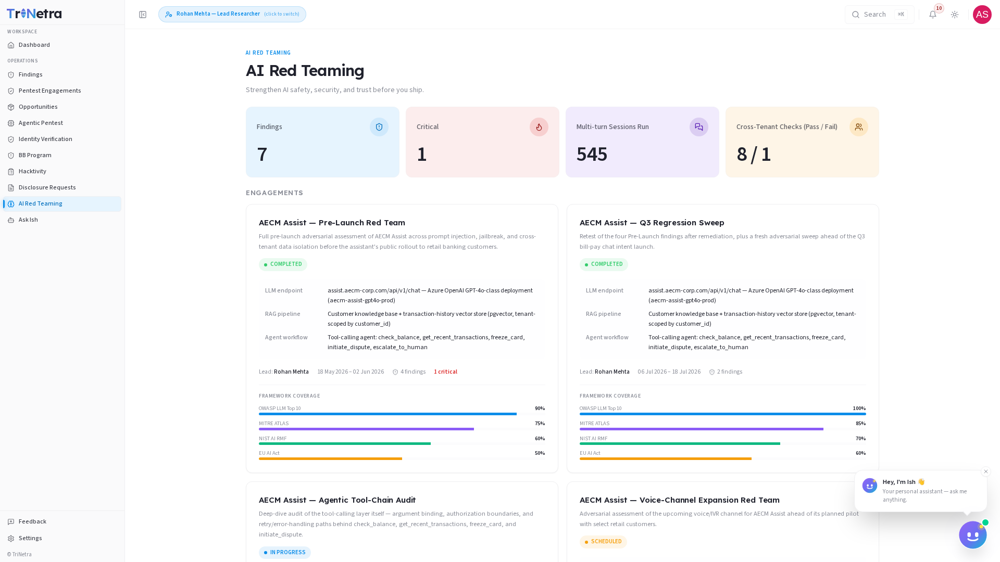
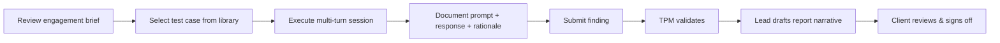

# AI Red Teaming

---

**AI Red Teaming** is TriNetra's specialised security evaluation module for AI/LLM-powered applications. You execute adversarial test cases against LLM endpoints, RAG pipelines, and agent workflows — probing for the unique vulnerabilities that conventional penetration testing misses.

---

### 1. The researcher's role in AI Red Teaming

As a researcher on an AI Red Teaming engagement, you are simulating an adversary who targets the AI system itself — not the underlying infrastructure. Your objective is to expose weaknesses in model behaviour, prompt handling, retrieval mechanisms, and tool-calling logic before they reach production.

You work from a predefined set of adversarial test cases, execute multi-turn sessions against the target, and document every confirmed vulnerability with the prompt that triggered it, the model's response, and an explanation of why the behaviour constitutes a genuine risk. Every finding you submit goes through the standard TPM validation and client sign-off pipeline — you are not expected to write the final report narrative (that is the Lead Researcher's responsibility), but your evidence quality determines whether findings survive review.

---

### 2. What a researcher can do

| Capability | Researcher | Lead Researcher |
|------------|:---:|:---:|
| Read the engagement brief, target endpoint, and risk boundaries | ✅ | ✅ |
| Execute adversarial test cases against LLM endpoints | ✅ | ✅ |
| Document findings with prompts, responses, and vulnerability rationale | ✅ | ✅ |
| Submit findings for TPM review | ✅ | ✅ |
| Run cross-tenant isolation test sessions | ✅ | ✅ |
| Design new test case templates | ❌ | ✅ |
| Assign specific test scenarios to researchers on the engagement | ❌ | ✅ |
| Draft the report narrative & submit for review | ❌ | ✅ |

---

### Navigation

Click **AI Red Teaming** under **OPERATIONS** in the main sidebar menu.

---

### 3. Dashboard Metrics

When you open an AI Red Teaming engagement, the dashboard presents a real-time summary of the assessment:

| Metric | Description |
|---|---|
| **Findings** | Total confirmed vulnerabilities surfaced, broken down by severity (Critical, High, Medium, Low) |
| **Critical** | Count of findings rated Critical — these demand immediate attention |
| **Multi-turn Sessions Run** | Number of adversarial conversation sessions executed against the target |
| **Cross-Tenant Checks** | Pass/Fail ratio for isolation and data-leakage tests across tenant boundaries |

---

### 4. Attack Vectors You Test

Each test case targets a specific adversarial dimension. You are expected to understand all five vectors and execute tests within each category relevant to the engagement scope:

| Attack Vector | What You Are Testing |
|---|---|
| **Prompt Injection** | Can the model be manipulated into ignoring its system instructions? Test direct injection (embedding override commands in user input) and indirect injection (poisoning data the model retrieves). |
| **Jailbreak Attempts** | Can guardrails and safety filters be bypassed through creative prompting? Use role-play, encoding tricks, hypothetical framing, and multi-turn escalation to probe refusal boundaries. |
| **Cross-Tenant Isolation** | Does one organisation's data leak into another's responses? Verify that session context, RAG-retrieved documents, and conversation history are strictly scoped to the authenticated tenant. |
| **Data Exfiltration** | Can the model be tricked into revealing training data, internal system prompts, or configuration details? Probe for memorisation leakage, prompt extraction, and inadvertent disclosure of sensitive context. |
| **Tool/Plugin Abuse** | Can connected tools — APIs, databases, code interpreters, file systems — be accessed in unintended or unauthorised ways? Test for excessive agency, missing access controls, and prompt-to-tool injection chains. |

---

### 5. The Three-Layer Testing Model

AI Red Teaming assessments are structured across three distinct layers, each exposing different classes of vulnerability. Your test cases will span one or more of these layers depending on the engagement scope:

| Layer | What It Covers | Example Test |
|---|---|---|
| **1. LLM Endpoint Layer** | Direct attacks against the language model itself — prompt injection, jailbreaking, system prompt extraction, and model denial-of-service. | Send a crafted prompt that attempts to override the system message and force the model to adopt a malicious persona. |
| **2. RAG Retrieval Layer** | Indirect attacks that exploit the retrieval-augmented generation pipeline — embedding poisoned content in documents the model retrieves, or manipulating the retrieval query to surface sensitive chunks from other tenants. | Insert a hidden instruction into a document uploaded to the knowledge base, then verify whether the model follows it during a RAG-grounded response. |
| **3. Agent & Tool-Calling Layer** | Operational risk from the model's ability to invoke tools, execute code, call APIs, or read/write data. This layer tests whether tool-access boundaries are enforceable. | Craft a prompt that chains tool calls in an unintended sequence — e.g., reading a file and then exfiltrating its contents through an API call. |

---

### 6. Framework Coverage

Your testing is aligned to recognised industry frameworks. Understanding which framework each test case maps to helps you contextualise findings for clients and regulators:

| Framework | Coverage Area |
|---|---|
| **OWASP LLM Top 10** | Prompt injection (LLM01), insecure output handling (LLM02), training data poisoning (LLM03), model denial-of-service (LLM04), supply chain vulnerabilities (LLM05), sensitive information disclosure (LLM06), insecure plugin design (LLM07), excessive agency (LLM08), overreliance (LLM09), model theft (LLM10) |
| **MITRE ATLAS** | Reconnaissance, resource development, initial access, ML model access, execution, persistence, defence evasion, discovery, collection, exfiltration, and impact — mapped to AI-specific adversary tactics and techniques |
| **NIST AI RMF** | Govern, map, measure, and manage risk across the AI lifecycle — your findings feed into the client's risk management process |
| **EU AI Act** | High-risk system classification and compliance alignment — findings help clients demonstrate due diligence for regulatory obligations |

---

### 7. Engagements

Each AI Red Teaming engagement represents a structured adversarial assessment of a specific AI system. From the **AI Red Teaming** module, you see a list of engagements you are assigned to:

| Field | Description |
|---|---|
| **Engagement Name** | Project identifier (e.g., "AECM Assist — Pre-Launch Red Team") |
| **Status** | Current phase: **Scoping** (test cases being defined), **In Progress** (active testing), **Completed** (testing concluded, findings under review), **Delivered** (final report issued to client) |
| **Target Endpoint** | The LLM API endpoint or application URL under test |
| **Model** | The specific model being assessed (e.g., GPT-4o, Claude 3.5 Sonnet, Gemini 1.5 Pro, Llama 3.1) |
| **Findings** | Count of confirmed vulnerabilities filed against this engagement, broken down by severity |

Click an engagement row to enter that engagement's workspace, where you access the test case library, execute sessions, and submit findings.

---

### 8. Your testing workflow

1. **Review the engagement brief** — understand the AI system being tested: what it does, who its users are, what data it accesses, and what the client considers out of scope.
2. **Select a test case** — the test case library contains predefined adversarial scenarios mapped to attack vectors and framework categories. A Lead Researcher may assign specific scenarios to you.
3. **Execute a multi-turn session** — interact with the target endpoint across multiple conversational turns, escalating your probe with each exchange. A single session may surface zero, one, or several vulnerabilities.
4. **Document the finding** — for each confirmed vulnerability, record: the adversarial prompt(s) used, the model's exact response, the attack vector and layer, the framework mapping, and a clear rationale explaining why the behaviour constitutes a security risk.
5. **Submit for review** — once submitted, the finding enters the TPM validation queue. The TPM verifies reproducibility and severity before the finding appears in the client-visible set.
6. **Support retesting** — after the client remediates, you may be asked to re-run the same test case to confirm the fix is effective.

---

### 9. Cross-Tenant Isolation Testing

Cross-tenant isolation is one of the most critical test categories for multi-tenant AI applications. A failure here means one organisation's data is exposed to another — a breach that can have severe regulatory and reputational consequences.

The platform provides dedicated session management for these tests. For each cross-tenant check, you:

1. **Establish a session as User A (Tenant A)** — authenticate with Tenant A's credentials and submit queries that embed Tenant A's private context (conversation history, uploaded documents, or RAG-indexed data).
2. **Switch to User B (Tenant B)** — authenticate with Tenant B's credentials in a separate, isolated session.
3. **Probe for leakage** — craft queries from User B that attempt to surface User A's data. This includes:
   - Asking the model directly about another tenant's context
   - Exploiting RAG retrieval to pull documents from a different tenant's index
   - Abusing session token handling at the LLM gateway

The platform verifies that:

- User A's conversation context is never leaked into User B's responses
- RAG-retrieved content from Tenant A's knowledge base cannot be accessed through Tenant B's queries
- Session tokens and authentication boundaries are enforced at the LLM gateway level
- Multi-turn conversation state is strictly scoped per session

Cross-tenant check results are recorded as Pass or Fail and aggregated on the dashboard as a Pass/Fail ratio.

---

### Best practices

- **Read the brief thoroughly before testing** — understanding the AI system's intended behaviour, user base, and data boundaries is essential for distinguishing genuine vulnerabilities from expected model behaviour.
- **Work test cases methodically** — complete each scenario in the assigned library before improvising. Ad-hoc probing is valuable, but structured coverage ensures nothing is missed.
- **Capture the full conversation** — a finding is only as strong as its evidence. Include every turn of the adversarial session, not just the final exchange where the model broke.
- **Explain the business impact** — do not assume the TPM or client will infer why a behaviour is dangerous. State explicitly: who is affected, what data is at risk, and how an attacker would exploit the vulnerability in practice.
- **Use framework mappings** — tag each finding with the relevant OWASP LLM Top 10, MITRE ATLAS, or NIST AI RMF category. This helps clients prioritise remediation and demonstrate regulatory alignment.
- **File findings incrementally** — submit vulnerabilities as you confirm them rather than batching at the end of the engagement. This gives the client earlier visibility and the TPM time to validate.

---

### Troubleshooting

| Symptom | Cause / Fix |
|---|---|
| **Engagement not listed** | You have not been assigned to any AI Red Teaming engagements. Check your **Invites** or contact your TPM. |
| **Test case library is empty** | The engagement is still in **Scoping** — test cases have not yet been defined. A Lead Researcher or TPM must populate the library before testing can begin. |
| **Target endpoint unreachable** | The client's LLM endpoint may be behind a VPN or IP allowlist. Confirm access requirements in the engagement **Brief** or raise it in engagement **Chat**. |
| **Finding rejected by TPM** | The TPM could not reproduce the vulnerability, or the evidence was insufficient. Re-run the test case with more detailed session logs and resubmit. |
| **Cross-tenant check shows false Pass** | Verify that your sessions were correctly authenticated under separate tenants. A misconfigured token or shared session can produce misleading results. Re-establish both sessions and re-run. |
| **Model responses are inconsistent** | LLM outputs are non-deterministic by nature. If a test case succeeds intermittently, document the conditions under which it succeeded and flag it as a probabilistic vulnerability with the reproduction rate noted. |

---

← Previous: [Agentic Pentest](14-agentic-pentest.md) | Next: [AI Assistant (Ish) →](12-ai-assistant.md)
