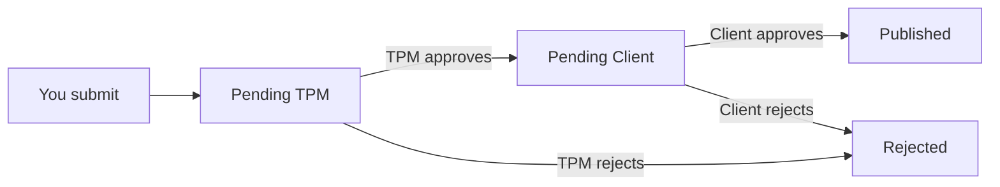

# Disclosure Requests (Researcher View)

**Disclosure Requests** is where you manage the process of publicly disclosing vulnerabilities you have discovered and had resolved. It appears under **Bug Bounty** in the sidebar.

---

## Accessing Disclosure Requests

1. Sign in as a Researcher
2. In the sidebar, under **OPERATIONS**, click **Disclosure Requests**

---

## The Request Lifecycle

Each disclosure request moves through four stages:

| State | Description |
|---|---|
| Pending TPM | You submitted the request; it is awaiting review by the TriNetra Program Manager |
| Pending Client | TPM has approved the technical accuracy; awaiting client authorisation |
| Published | The client approved — the disclosure is now live on Hacktivity |
| Rejected | The request was denied (by TPM or client) |

Use the filter tabs at the top of the page — **All**, **Pending TPM**, **Pending Client**, **Published**, **Rejected** — to track requests at each stage.

---

## Submitting a Disclosure Request

1. Navigate to **Disclosure Requests** from the sidebar
2. Click the button to create a new request
3. Select the resolved finding you wish to disclose
4. Write a public-facing summary:
   - **Title** — a clear, descriptive name for the vulnerability
   - **Description** — technical details of the finding, impact, and remediation
   - Keep it professional and educational — focus on the vulnerability, not the affected organisation
5. Submit for TPM review

---

## What Happens After Submission

1. **TPM Review** — the Platform Manager validates the technical accuracy of your disclosure and checks for policy compliance
2. **Client Authorisation** — the affected client reviews and decides whether to allow public release
3. **Publication** — once approved, the disclosure appears on Hacktivity under your name

---

## Tips for Successful Disclosures

- **Write for a technical audience** — clear reproduction steps, real impact, and actionable remediation advice make for stronger disclosures
- **Be patient** — the review process involves multiple parties; response times vary
- **Check the status** — use the filter tabs to track where each request is in the pipeline
- **Don't take rejection personally** — clients may have legitimate confidentiality or regulatory reasons for denying a disclosure
- **Redact sensitive details** — never include client names, internal hostnames, or proprietary information unless explicitly authorised

---

← Previous: [Hacktivity](17-hacktivity.md) | Next: [AI Assistant →](12-ai-assistant.md)
