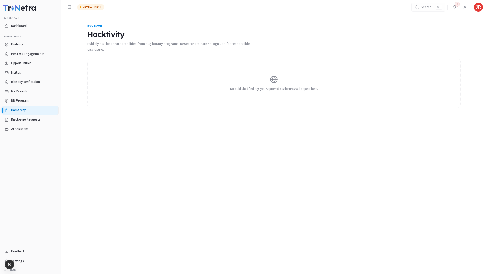
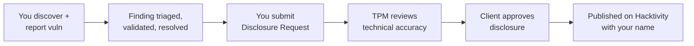

# Hacktivity

**Hacktivity** is the public feed of disclosed vulnerabilities from bug bounty programs. It appears under **Bug Bounty** in the sidebar. Published disclosures earn you public recognition for responsible disclosure and build your professional reputation.

---

## Accessing Hacktivity

---

1. Sign in as a Researcher
2. In the sidebar, under **OPERATIONS**, click **Hacktivity**

---

## What Appears Here

Publicly disclosed vulnerabilities from bug bounty programs. Each entry includes the finding title, severity, CVSS score, technical description, researcher attribution, and publication date. The feed is ordered with the most recent disclosures first.

---

## How Disclosures Get Here

---

## Why Hacktivity Matters for Researchers

- **Reputation** — your name and findings are publicly visible, building credibility for future engagements and bug bounty invites
- **Portfolio** — each published disclosure becomes part of your professional track record
- **Community** — contributes to the broader security community's knowledge base
- **Recognition** — demonstrates your expertise to potential clients and programme managers

---

## Tips for Researchers

- Write clear, educational disclosures — focus on the technical finding, not the client
- Redact any sensitive client-identifying information unless explicitly authorised
- Submit disclosure requests promptly after a finding is resolved
- A well-written disclosure with clear reproduction steps and impact analysis is more likely to be approved

---

← Previous: [Bug Bounty](bug-bounty/overview.md) | Next: [Disclosure Requests →](16-disclosure-requests.md)

