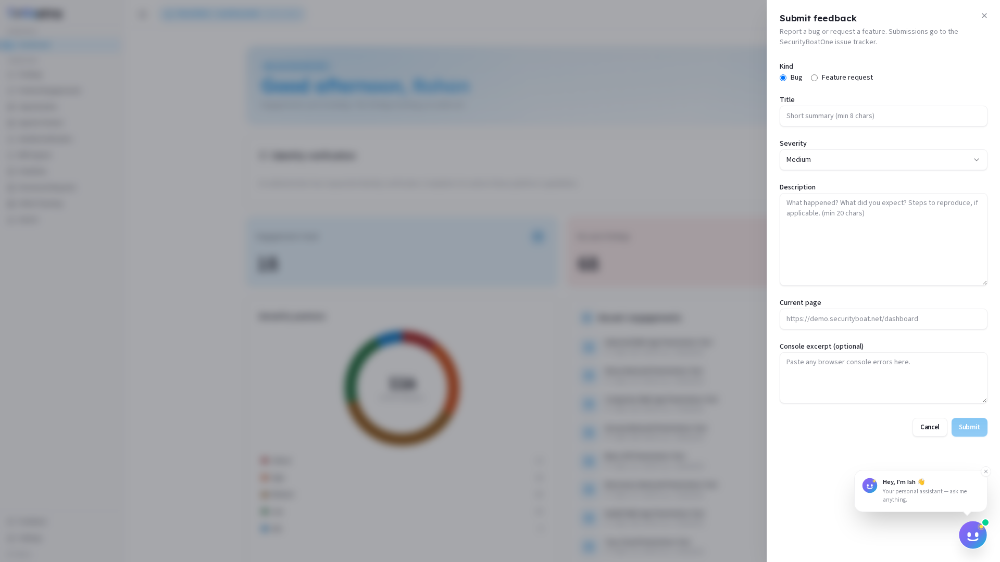

# Feedback

### 1. What Feedback is for

The **Feedback** module is a platform-wide dialog that lets you submit bug reports and feature requests directly to the SecurityBoatOne issue tracker. It is available to all roles and serves as the primary channel for reporting platform issues or suggesting improvements.

**The Feedback module is not a live support channel.** For urgent blockers — such as an engagement that will not load or a payout that has stalled — contact your TPM or Lead Researcher directly.

---

### Navigation

The **Feedback** button sits at the bottom of the sidebar, below all other navigation items. It is always visible regardless of which page you are viewing.

---

### 2. The Feedback Dialog

Clicking **Feedback** opens a modal dialog with the following fields:

| Field | Required | Description |
|---|---|---|
| **Kind** | Yes | Radio buttons: **Bug** (report something broken) or **Feature Request** (suggest an enhancement). |
| **Title** | Yes | A concise, one-line summary of the issue or request. |
| **Severity** | No | Dropdown: **Low**, **Medium**, **High**, or **Critical**. Only relevant for bug reports. |
| **Description** | Yes | A detailed explanation — include steps to reproduce, expected behaviour, and actual behaviour. |
| **Current page** | Auto-filled | The URL of the page you were on when you opened the dialog. The engineering team sees exactly where you encountered the issue. You can edit this if needed. |
| **Console excerpt** | No | Optional — paste any errors from your browser's developer console (F12 → Console tab). Helps diagnose front-end issues. |

The **Submit** button remains disabled until **Kind**, **Title**, and **Description** are all filled.

---

### 3. When to use each kind

| Use **Bug** when… | Use **Feature Request** when… |
|---|---|
| Something that previously worked has broken | You want new functionality that does not exist yet |
| A feature behaves differently than documented | An existing feature could be improved or extended |
| You receive an error message or unexpected result | You need a new filter, sort, or view option |
| Data displays incorrectly or inconsistently | A workflow is missing a step that would help you |
| A page fails to load or times out | You have an idea that would make the platform more productive |

When in doubt, choose **Bug** if the platform is not working as you reasonably expect it to. Choose **Feature Request** if it works as designed but you wish it did more.

---

### 4. Researcher-specific scenarios

These are common situations researchers encounter and the recommended submission type:

| Scenario | Kind | Notes |
|---|---|---|
| Agentic Pentest discovery feed not updating | Bug | Note which engagement and whether the Live Recon tab or Human Review Queue is affected. |
| AI Red Teaming engagement not loading | Bug | Include the engagement name. If it is time-sensitive, also notify your TPM. |
| Finding shows incorrect severity in the UI | Bug | Mention the finding ID and the severity you believe is correct. |
| Ask Ish returns irrelevant or incorrect responses | Bug | Paste the question you asked and the response you received. |
| Need a new filter or sort option in the findings list | Feature Request | Describe the filter/sort you need and why it would help your workflow. |
| Sign-off workflow missing a step | Feature Request | Explain what step is missing and where in the process it belongs. |
| Dashboard metrics do not match the findings list | Bug | Reference both views so the team can cross-check. |
| Want a dark mode or UI theme option | Feature Request | These are valid — the product team reviews all submissions. |

---

### 5. Writing an effective bug report

A well-written bug report saves the engineering team time and gets your issue resolved faster. Every report should answer three questions: **what happened**, **what you expected**, and **how to reproduce it**.

**Example — good bug report:**

> **Kind:** Bug
> **Title:** Agentic Pentest discovery feed stops updating after switching engagements
> **Severity:** High
> **Description:**
> - **Steps to reproduce:** Open Agentic Pentest → select Engagement A from the dropdown → observe the Live Recon feed updating normally → switch to Engagement B → the feed freezes and shows the last entries from Engagement A.
> - **Expected behaviour:** The feed should refresh to show the discovery activity for Engagement B.
> - **Actual behaviour:** The feed remains frozen on Engagement A's data until the page is manually refreshed.
> - **Impact:** I cannot monitor live discoveries when working across multiple engagements.
> **Current page:** (auto-captured)
> **Console excerpt:** `Uncaught TypeError: Cannot read properties of undefined (reading 'id') at FeedComponent.updateFeed`

**Example — poor bug report:**

> **Kind:** Bug
> **Title:** Feed broken
> **Description:** The feed doesn't work. Please fix.

The poor report gives the engineering team nothing to work with. Always include steps, expected behaviour, and actual behaviour.

---

### Best practices

- **Submit one issue per report.** Do not bundle multiple bugs or feature requests into a single submission — each needs its own tracking and resolution.
- **Be specific and actionable.** Include reproduction steps, expected vs actual behaviour, and the impact on your work.
- **Use the auto-captured URL.** The **Current page** field tells the engineering team exactly where the problem occurred. Only edit it if the captured page is wrong.
- **Include console errors for front-end issues.** Open your browser's developer tools (F12), go to the **Console** tab, and copy any red error messages into the **Console excerpt** field. This is often the fastest way to diagnose UI bugs.
- **Choose severity honestly.** Reserve **Critical** for issues that completely block your ability to work (e.g., cannot submit findings, cannot access engagements). Use **High** for major functional breaks with no workaround.
- **For feature requests, explain the "why".** Describe the problem you are trying to solve, not just the solution you envision. The product team may find a better approach.
- **Do not use Feedback for urgent support.** The issue tracker is not monitored in real time. If an engagement deadline is at risk, contact your TPM or Lead Researcher directly.

---

### Troubleshooting

| Symptom | Cause / Fix |
|---|---|
| **Submit button stays disabled** | At least one required field (Kind, Title, Description) is empty. Fill all three to enable the button. |
| **Not sure whether to submit a Bug or Feature Request** | Refer to the table in section 3. If still unsure, default to Bug — the triage team can reclassify it. |
| **Issue is blocking your work right now** | Feedback is not a live support channel. Submit the bug report for tracking, then contact your TPM or Lead Researcher for immediate help. |
| **Need to follow up on a previous submission** | Feedback submissions go to the SecurityBoatOne issue tracker. Your TPM can look up the status of your ticket. |
| **Not sure what to put in Console excerpt** | Open DevTools (F12), click the Console tab, and look for red error lines. Copy those — even a partial stack trace is helpful. If the console is clean, leave the field empty. |

---

← Previous: [AI Assistant (Ish)](12-ai-assistant.md) | Next: [Settings →](13-settings.md)
