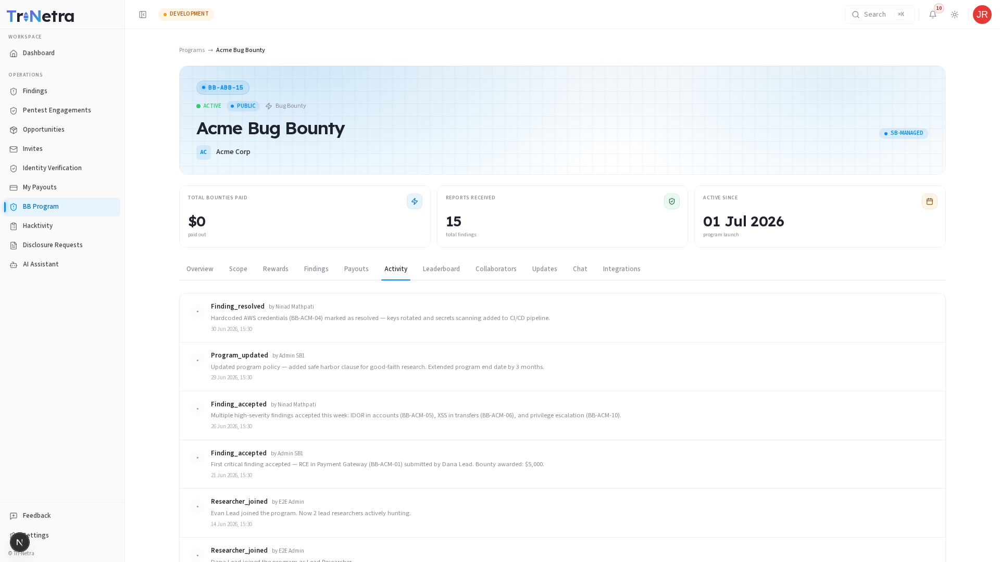

# Activity

The **Activity** tab provides a read-only, chronological log of events related to the Bug Bounty or VDP program. It helps researchers track historical changes, updates, and scope adjustments.

---

## Logged Events

The activity log records the following milestones:

| Event Type | Description |
| :--- | :--- |
| **Program Status Updates** | Changes in program state (e.g., when a program is activated, paused, or closed). |
| **Scope Changes** | Notifications of newly added assets, URL shifts, or assets moved out-of-scope. |
| **Reward Scale Updates** | Increases or adjustments to the reward ranges. |
| **New Updates Published** | Logs when a new announcement is posted on the Updates tab. |
| **Submissions & Payouts** | Broad entries confirming finding submissions or payout confirmations. |

!!! note
    Out of respect for researcher privacy, finding details, specific reporter names, and payout specifics are anonymized or hidden from the general activity log.

---

← Previous: [Payouts](payouts.md) | Next: [Leaderboard →](leaderboard.md)
