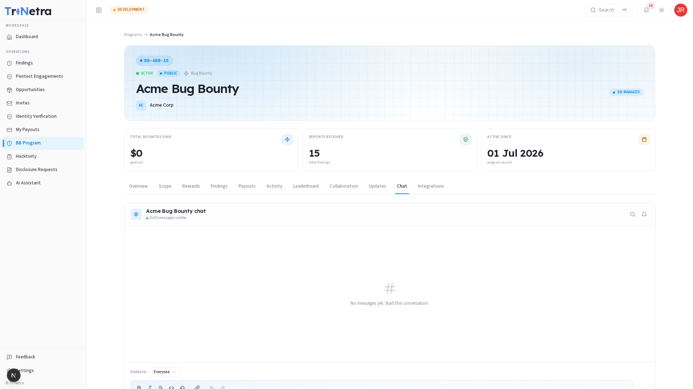

# Chat

The **Chat** tab provides a direct communication channel for the program.

---

## Channel Structure

Depending on the program's setup, the chat tab behaves in one of two ways:

| Channel Type | Access Level | Purpose |
| :--- | :--- | :--- |
| **Read-Only Channel** | Public Programs | SecurityBoat triagers and client admins post alerts, scope announcements, or system downtime warnings. |
| **Interactive Triage Chat** | Private Programs | Bidirectional conversation. Researchers can ask questions regarding scope, credentials, and speak with the TPM. |

---

## Chat Guidelines & Best Practices

If interactive chat is enabled, please adhere to these guidelines:

| Guideline | Rule / Policy |
| :--- | :--- |
| **Do Not Share Findings** | Do not paste vulnerability details, PoC code, or exploits in the general chat. Submissions must *only* be uploaded via the **Submit Finding** drawer. |
| **Be Professional** | Maintain a polite and professional tone at all times. |
| **No Spamming** | Keep questions concise and relevant to the scope of testing. |

---

← Previous: [Updates](updates.md) | Next: [Integrations →](integrations.md)
