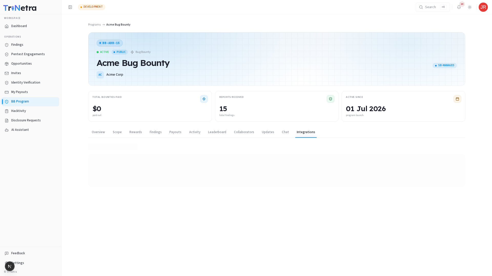
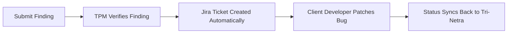

# Integrations

The **Integrations** tab lists third-party tools that have been linked to this program by the client organization.

---

## Active Integrations

While researchers do not configure integrations, you can see which tools are connected (e.g., **Jira**).

### Jira Integration
When Jira is connected and active:
*   Once your submitted finding moves to the **Verified** state, it is automatically pushed as an issue ticket to the client's internal Jira board.
*   This ensures fast visibility for the client's developers, speeding up the patch lifecycle and expediting your payouts.
*   Status updates in the client's Jira system can sync back, updating the finding state on the Tri-Netra platform automatically.

The diagram below illustrates the automated Jira synchronization flow:

---

← Previous: [Chat](chat.md) | Back to: [Bug Bounty Overview](../overview.md)
