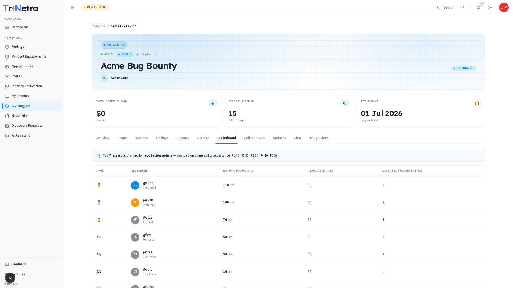

# Leaderboard

The **Leaderboard** tab highlights the top-performing researchers who have successfully submitted valid findings to this program. It drives peer recognition and gamifies the testing process.

---

## Leaderboard Rankings

Researchers are ranked based on the total **Reputation Points** earned on this specific program. The tab features:

### The Top 3 Podium
A visually prominent section highlighting the three highest-scoring researchers for the current filter window.

### Detailed Ranking Table
Lists all contributing researchers. The columns include:

| Column | Description |
| :--- | :--- |
| **Rank** | Numeric position. |
| **Researcher** | Platform username and avatar. |
| **Reputation Points** | Total points earned on this program. |
| **Accepted Submissions** | Count of valid findings verified by the TPM. |
| **Rewards Earned** | Swag tier or total monetary rewards. |

---

## Filter Options

You can filter the leaderboard to track activity over different periods:

| Filter | Scope |
| :--- | :--- |
| **Today** | Ranks researchers by points earned in the last 24 hours. |
| **This Week** | Focuses on the current calendar week. |
| **All Time** | Accumulates all points since the program was launched. |

---

## Why Leaderboard Standing Matters

Your position on leaderboards directly affects your opportunities on the platform:

| Benefit | How It Works |
| :--- | :--- |
| **Private Program Invites** | Organizations hosting high-payout, private Bug Bounty programs inspect leaderboards to select which researchers to invite. |
| **Reputation & Trust** | Top-ranked researchers are selected as Lead Researchers for scheduled PTaaS engagements. |

---

← Previous: [Activity](activity.md) | Next: [Collaborators →](collaborators.md)
