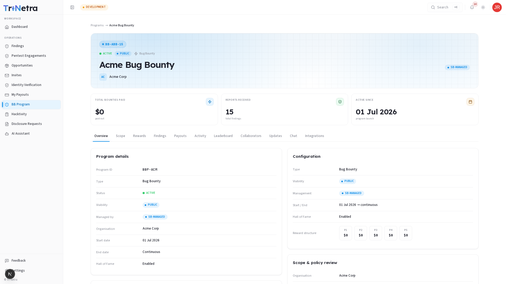
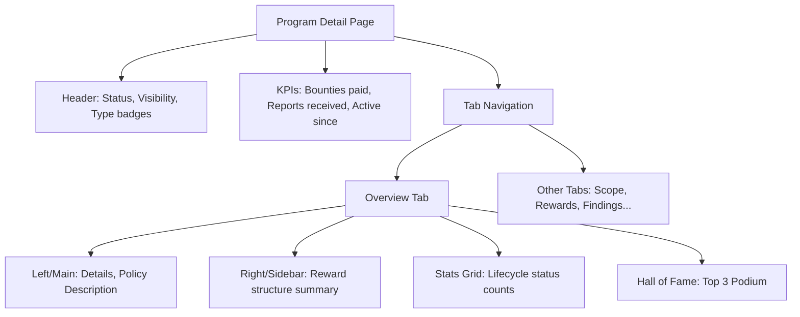

# Program Detail Overview

When you select a Bug Bounty or VDP program, you land on the **Program Detail** view. This interface acts as your primary portal for testing and tracking submissions for a specific target organization.

---

## Page Layout & Tab Structure

The diagram below outlines the structural layout of the Program Detail view:

---

## Page Header & KPIs

At the top of the program detail page, the header bar identifies the target at a glance:

| Header Element | Description |
| :--- | :--- |
| **Program Code** | A unique reference (e.g., `BBP-ACM`) displayed in a pill badge. |
| **Status Badge** | Indicates whether the program is **Active**, **Inactive**, or **Closed**. |
| **Visibility Badge** | Indicates **Public** (blue) or **Private** (purple) access. |
| **Type Label** | Indicates whether the program is a **VDP** or a **Bug Bounty**. |
| **Program Name** | The full program name. |
| **Management Badge** | Shows whether the program is **SB-Managed** (triaged by SecurityBoat) or **Self-Managed** (triaged by Organization). |

### Summary KPI Tiles

Directly below the header are three metrics that summarize your or the program's history:

| KPI Tile | Description |
| :--- | :--- |
| **Total Bounties Paid / Recognition** | Cumulative cash paid out (Bug Bounty) or recognition summary (VDP). |
| **Reports Received** | Total findings submitted by all researchers to this program. |
| **Active Since** | The launch date of the program. |

---

## Tab Navigation

The program detail view is structured into eleven tabs. Click a tab to switch views; your position is preserved in the URL.

| Tab | What It Contains |
| :--- | :--- |
| **Overview** | Program rules, target info, finding status counts, and the Hall of Fame podium. |
| **Scope** | Explicit lists of in-scope and out-of-scope assets. |
| **Rewards** | Payout ranges (P1–P5) or recognition rules. |
| **Findings** | List of findings you submitted to this program + the submission button. |
| **Payouts** | Tracking for your approved bounties on this program. |
| **Activity** | Chronological log of program milestones (scope updates, status changes). |
| **Leaderboard** | Rankings of top researchers on this program based on accepted bugs. |
| **Collaborators** | Fellow researchers participating in the program. |
| **Updates** | Official policy or target updates posted by the security team. |
| **Chat** | Read-only general channel or interactive messaging (program dependent). |
| **Integrations** | Reference list of connected third-party integrations (e.g., Jira). |

---

## Overview Tab Content

The **Overview** tab provides a dual-column summary:

### Left Column: Program Details & Policy

| Section | Description |
| :--- | :--- |
| **Program Metadata** | Key fields showing Start Date, End Date ("Continuous" if open-ended), and Hall of Fame settings. |
| **Description** | Background information about the organization and any high-level testing policies. |

### Right Column: Configuration & Rewards Summary

*   A summary card displaying the current P1 through P5 reward tiers (monetary or point-based).

### Program Finding Stats

A grid showing your finding counts on this program, split by lifecycle states:

| State | Description |
| :--- | :--- |
| **Total** | All findings you submitted to this program. |
| **Triage** | New findings awaiting TPM review. |
| **Accepted** | Confirmed vulnerabilities currently in remediation. |
| **Resolved** | Findings that have been patched. |
| **Discarded** | Submissions rejected as duplicates, out-of-scope, or invalid. |

### Hall of Fame Podium

If the Hall of Fame is enabled, a podium displays the top three contributing researchers for the program (based on reputation points).

*   Filters allow viewing rankings for **Today**, **This Week**, or **All Time**.
*   If no accepted findings exist yet, a placeholder message is displayed: *"No researchers on the leaderboard yet. Top contributors will appear once findings are accepted."*

---

← Previous: [Bug Bounty Overview](../overview.md) | Next: [Scope →](scope.md)
