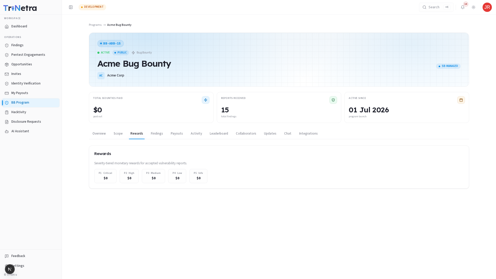
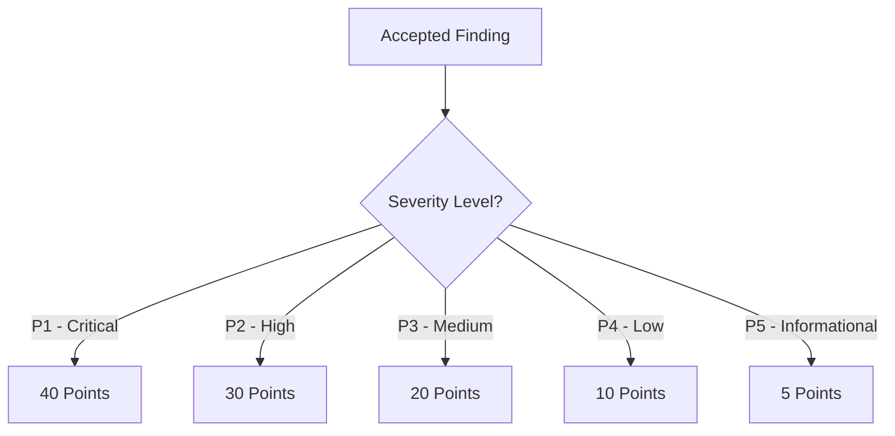

# Rewards

The **Rewards** tab defines the incentive structure of the program. Depending on whether the program is a Bug Bounty or a VDP, rewards may consist of monetary payouts, reputation points, or recognition swag.

---

## Monetary Payout Grid (Bug Bounty)

For paid Bug Bounty programs, rewards are structured into a tier-based grid matching the severity classification of findings. Severity is determined using the **CVSS v4.0** score calculated during submission:

| Severity Level | CVSS v4.0 Range | Standard Reward Range (Example) |
| :--- | :--- | :--- |
| **P1 — Critical** | 9.0 – 10.0 | \$1,500 – \$3,000+ |
| **P2 — High** | 7.0 – 8.9 | \$800 – \$1,499 |
| **P3 — Medium** | 4.0 – 6.9 | \$300 – \$799 |
| **P4 — Low** | 0.1 – 3.9 | \$100 – \$299 |
| **P5 — Informational** | 0.0 | Swag / Points Only |

> [!TIP]
> Individual program reward ranges are set by the client and may vary. Always refer to the live grid on the Rewards tab.

---

## Vulnerability Disclosure Program (VDP) Recognition

VDPs do not offer cash payouts. Instead, they reward valid contributions through:
*   **Swag**: T-shirts, stickers, or branded merchandise shipped to your verified address.
*   **Hall of Fame**: Public listing on the program overview page, displaying top-performing researchers.
*   **Certificates**: A formal certificate of appreciation detailing your contribution.

---

## Reputation Points System

All valid findings (on both Bug Bounty and VDP programs) award **Reputation Points** upon transitioning to the **Verified** state. Reputation points determine your overall ranking on the leaderboard and eligibility for exclusive, high-paying private program invites.

The diagram below outlines the reputation points assigned based on finding severity:

### Reputation Deductions
To maintain high-quality submissions, the platform enforces deductions for poor-quality reports:
*   **Spam / Malicious reports**: -10 points.
*   **Repeated invalid out-of-scope submissions**: -5 points.

---

← Previous: [Scope](scope.md) | Next: [Findings →](findings.md)
