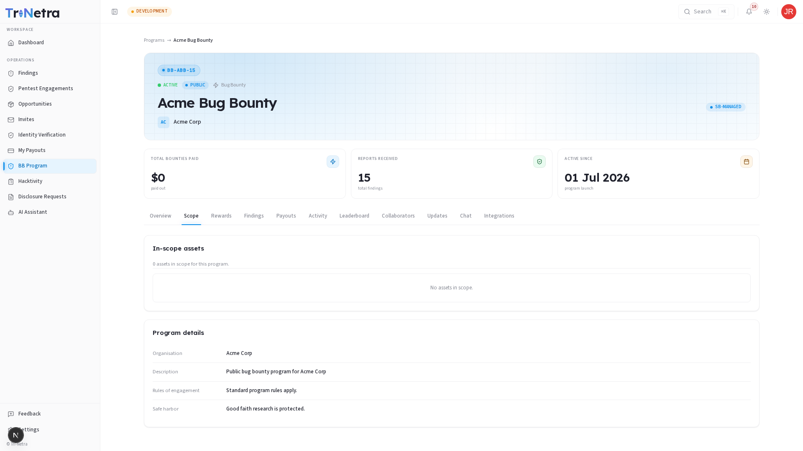

# Scope

The **Scope** tab acts as the formal contract between you and the client organization. It defines exactly what you are authorized to test, how you must identify yourself, and which assets are strictly off-limits.

---

## Scope Asset Tables

The tab is split into two primary lists:

### 1. In-Scope Assets

These are the assets you are authorized to test. Each asset entry displays the following details:

| Field | Description |
| :--- | :--- |
| **Asset Name** | A label representing the target (e.g., `Acme Web Portal`). |
| **Type** | The platform category (Web Application, API, Mobile iOS/Android, Cloud, Network, Source Code, AI/LLM Model). |
| **Target/URL** | The specific domain, API gateway, IP range, or repository path. |
| **Instructions / Credentials** | Special notes for researchers, such as custom headers (e.g., `User-Agent: SecurityBoat-Researcher`), test credentials, or focus areas. |

### 2. Out-of-Scope Assets

These are systems or targets that are strictly excluded from testing. 

> [!WARNING]
> **Testing out-of-scope assets is a violation of platform guidelines.**

Out-of-scope lists typically include:
*   Third-party integrations or external payment gateways (e.g., Stripe, Paypal).
*   Production databases or sensitive backend endpoints.
*   Acquired subsidiaries or sandbox systems not owned by the parent program.

---

## Rules of Engagement & Testing Guidelines

When testing in-scope assets, you must follow the rules of engagement specified by the program:

| Guideline | Requirement / Standard |
| :--- | :--- |
| **Researcher Identification** | Always inject the requested HTTP identification header (detailed in asset instructions) so client teams can identify your traffic. |
| **Rate Limiting** | Do not flood the target with excessive requests. Keep scanning speeds within the limits defined in the policy (e.g., under 5 rps). |
| **Data Preservation** | Never modify, delete, or exfiltrate customer or organizational data. Stop and report as soon as an exploit is confirmed. |
| **No Disruptive Testing** | Refrain from launching Denial of Service (DoS/DDoS) attacks, brute-forcing user credentials, or social engineering. |

---

## Troubleshooting Scope Issues

| Problem | Cause / Solution |
| :--- | :--- |
| **No credentials listed for a Grey-Box target** | If the program is marked Grey-Box but no credentials are provided in the instructions, request them via the program **Chat** or contact a SecurityBoat TPM. |
| **Unsure if a subdomain is in-scope** | If the scope list contains wildcard entries (e.g., `*.acme.test`), subdomains are in-scope. If it is a flat list, only the exact domains listed are in-scope. When in doubt, ask in **Chat** before testing. |

---

← Previous: [Program Details Overview](overview.md) | Next: [Rewards →](rewards.md)
