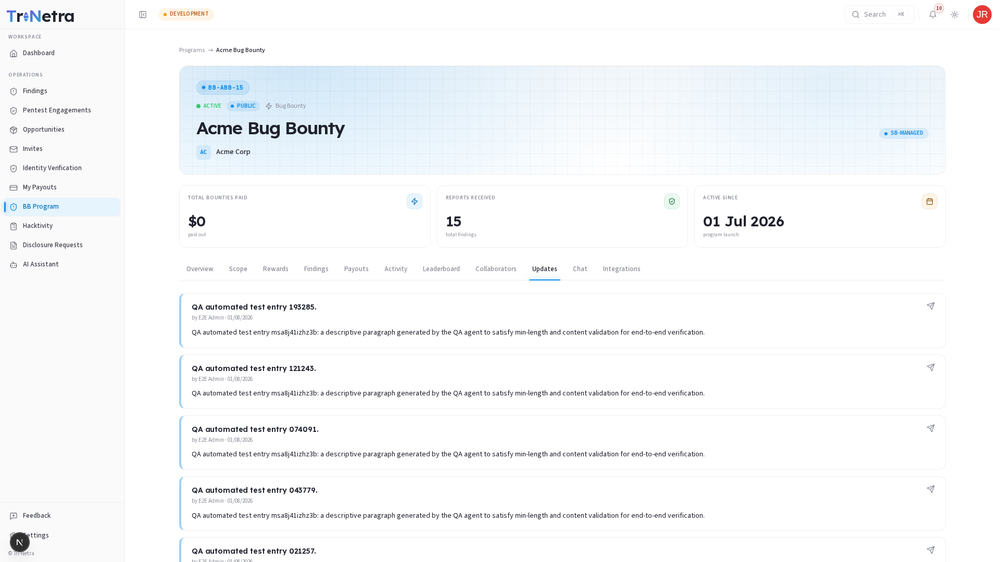

# Updates

The **Updates** tab is the official communication board for the program. It is managed by the SecurityBoat triage staff and client administrators to keep researchers updated on critical program modifications.

---

## What is Posted in Updates?

Whenever an important change is made to the program, an update is posted. Common updates include:

| Update Type | Description |
| :--- | :--- |
| **Scope Expansions** | Notice of newly added assets or IP ranges. |
| **Scope Reductions** | Removal of assets that are undergoing maintenance or are no longer eligible for testing. |
| **Reward Boosts** | Temporary or permanent increases in reward values (e.g., *"Double payouts on API vulnerabilities this week!"*). |
| **Policy Adjustments** | Updates to safe harbor terms, report formatting requirements, or forbidden testing techniques. |

---

## Reading Updates

Each update card displays:

| Card Element | Description |
| :--- | :--- |
| **Title** | The headline of the announcement. |
| **Author** | The SecurityBoat CSM or client manager who posted the update. |
| **Date** | Timestamp of publication. |
| **Content** | Rich text detailing the update. |

> [!TIP]
> Always check the Updates tab first before starting a testing session. This ensures you do not waste time testing retired assets or miss out on high-reward targets.

---

← Previous: [Collaborators](collaborators.md) | Next: [Chat →](chat.md)
