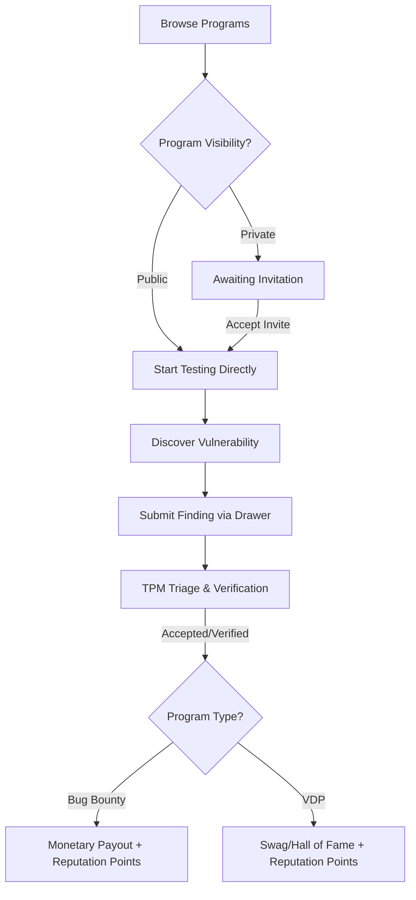

# Bug Bounty & VDP Overview

Welcome to the **Bug Bounty & VDP** module on the Tri-Netra platform. This guide helps you navigate, participate in, and submit vulnerability reports to continuous, rewarded security programs.

Bug Bounty testing on Tri-Netra is self-directed and continuous, complementing scheduled, team-based pentest engagements. As a researcher, you can browse programs, review their policies, test targets within scope, submit findings, and earn payouts or reputation points.

---

## Testing Workflow

The diagram below maps the typical lifecycle of a bug bounty or VDP submission on Tri-Netra:

---

## Program Types

Tri-Netra supports two types of crowdsourced security testing programs:

### 1. Bug Bounty
*   **Target Scope**: Critical enterprise production and staging environments.
*   **Incentives**: Tiered monetary payouts based on finding severity (P1–P5) plus reputation points.
*   **Verification**: Managed by SecurityBoat TPMs or client security leads.

### 2. VDP (Vulnerability Disclosure Program)
*   **Target Scope**: Responsible disclosure targets for safe harbor testing.
*   **Incentives**: Recognition-based rewards including swag, Hall of Fame placements, certificates of appreciation, and reputation points.
*   **Verification**: Self-managed by clients or SecurityBoat triage teams.

---

## Program Visibility & Access

Programs are categorized by visibility, which determines how you can access them:

*   **Public Programs**: 
    *   **Access**: Open to all registered and identity-verified researchers on the Tri-Netra platform.
    *   **Action**: You can begin testing in-scope assets immediately without requiring an invitation.
*   **Private Programs**: 
    *   **Access**: Invite-only programs based on reputation scores or custom skills.
    *   **Action**: Invitations appear under your **Invites** sidebar menu. Accepting a private invite grants you access to the program details and target scope.

---

## Program Statuses

Each program display card lists its current status, which dictates the activities you can perform:

*   **Active**: Testing is live. You can review the scope, perform testing, and submit findings via the Findings drawer.
*   **Inactive**: The program is temporarily paused. You can read policy details and view past findings, but target testing is paused, and finding submission is disabled.
*   **Closed**: The program has officially ended. All details are read-only, and no further submissions are accepted.

---

## Browsing Programs

To view the programs list, click **BB Program** in the main sidebar.

The listing page displays:
*   **Summary Metrics**: Quick counts of all programs, active programs, and total findings you have submitted.
*   **Program Cards**: Each card displays the organization avatar, program name, reference code, visibility (Public/Private), program type (Bug Bounty/VDP), active findings count, and status badge.
*   **Search & Filters**: Search by program name or filter by type (Bug Bounty, VDP) and visibility.

> [!NOTE]
> Click on any active program card to open the **Program Detail** view and access the individual testing tabs.

---

## Researcher Best Practices

*   **Always Verify Verification**: Ensure your profile status in the **Identity Verification** tab is green or in progress. Verified researchers receive priority and are eligible for monetary payouts.
*   **Review Scope Carefully**: Double-check the **Scope** tab before testing. Out-of-scope targets will not receive rewards or reputation points.
*   **Check Hacktivity & Leaderboard**: Inspect the **Hacktivity** feed and the program's **Leaderboard** to understand the common vulnerability classes found on the target and avoid duplicate submissions.
*   **Monitor Program Updates**: Read the **Updates** tab regularly to stay informed about scope shifts or reward boosts.

---

## Troubleshooting

| Symptom | Cause / Solution |
| :--- | :--- |
| **Cannot see a specific program** | The program may be Private and you have not been invited, or the invite has expired. Check your **Invites** page. |
| **Finding submission button is disabled** | The program is currently **Inactive** or **Closed**. Submissions are only permitted on **Active** programs. |
| **No monetary rewards shown for accepted findings** | The program is a **VDP** (Vulnerability Disclosure Program). Rewards are limited to swag, reputation points, and Hall of Fame recognition. |

---

← Previous: [Identity Verification](../10-verification.md) | Next: [Program Details Overview →](detail/overview.md)
