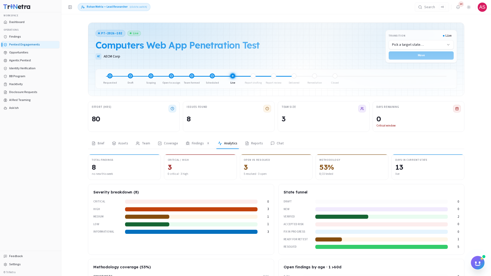

# Analytics

The **Analytics** tab provides visual representations and charts summarizing the vulnerability metrics for the engagement. It is a shared dashboard visible to the testing team and the client organization.

---

## Visual Dashboards

The analytics page displays three primary metrics:

### 1. Severity Distribution
A chart illustrating the breakdown of findings by severity rating (Critical, High, Medium, Low, Informational). This helps the client prioritize their development resources during the remediation phase.

### 2. Status Breakdown
A chart showing the count of findings by lifecycle status (Draft, New, Verified, resolved, duplicate, etc.). This visualizes the progress of the triage and patching workflow.

### 3. Finding Trends
A timeline graph tracking the cumulative number of vulnerabilities discovered over the course of the testing window.

---

← Previous: [Findings](findings.md) | Next: [Reports →](reports.md)
