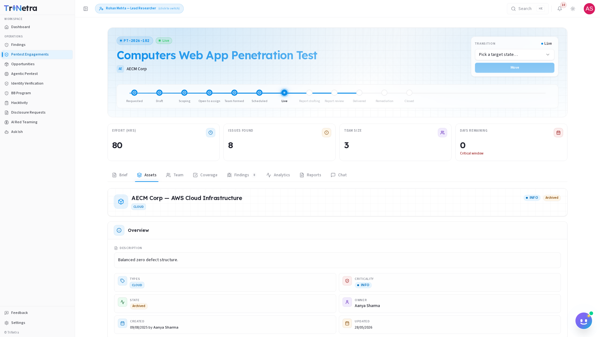

# Assets

The **Assets** tab houses the detailed technical information for each target item linked to the engagement. This page is essential for Grey-Box and White-Box testing, as it contains target details, IP ranges, mobile app binaries, API schemas, and active testing credentials.

---

## Assets Grid

The assets page presents a card grid or table listing each target asset:

| Asset Field | Description |
| :--- | :--- |
| **Asset Name** | A recognizable label (e.g., *Staging Authentication API*). |
| **Type** | Category of the asset (Web Application, API, Mobile, Network, Cloud, Source Code, AI/LLM Model). |
| **Target/URL** | The IP address, URL, or endpoint path. |
| **Asset Description** | Detailed context or testing goals specific to the asset. |

---

## Testing Credentials & Accounts

For authenticated testing (Grey-Box/White-Box), the client provides credentials. These are secure login records attached directly to individual assets.

Each credential block includes:

| Credential Field | Description |
| :--- | :--- |
| **Role/Type** | The user role associated with the credentials (e.g., *Standard User*, *Tenant Admin*, *Read-Only Viewer*). |
| **Username / ID** | The email or username to authenticate with. |
| **Password / Key** | The password, API token, or SSH key. |
| **Testing Notes** | Guidance on how to authenticate, where to find MFA bypass codes, or specific paths to test with these credentials. |

---

## Secure Asset Handling Guidelines

> [!WARNING]
> **Credential Confidentiality**: Credentials provided for testing are strictly confidential. Do not share them outside the engagement team or use them after the testing window closes.

| Handling Principle | Standard Protocol |
| :--- | :--- |
| **Credential Verification** | Verify all login credentials on the first day of the **Live** phase. If credentials are locked, expired, or have insufficient permissions, report it immediately in the engagement **Chat** tab. |
| **MFA Bypass** | If Multi-Factor Authentication is enabled on a target, clients may provide a static bypass code or a shared TOTP secret (listed in the credentials card) to enable automated or manual testing. |

---

← Previous: [Brief](brief.md) | Next: [Team →](team.md)
