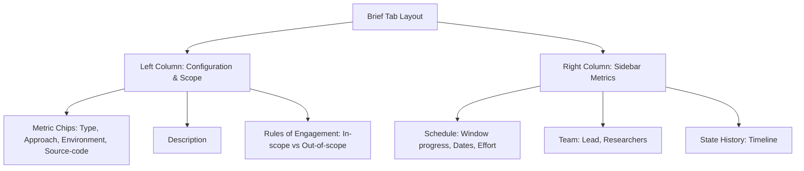

# Brief

The **Brief** tab is the default landing view when you open a pentest engagement. It provides a complete overview of the engagement's configuration, rules of engagement, testing schedule, and assigned team.

---

## Page Layout Diagram

The Brief tab is organized into a two-column layout as illustrated below:

---

## Left Column: Configuration & Scope

### 1. Configuration Metric Chips

Four key parameters define the testing environment:

| Chip Parameter | Supported Target Categories / Options |
| :--- | :--- |
| **Engagement Types** | Web Application, API, Mobile, Network, Cloud, IoT, Source Code. |
| **Testing Approach** | Black box (no info), Grey box (credentials/details provided), or White box (full access). |
| **Environment** | Production, Staging, QA, Development. |
| **Source-Code Access** | Indicates if repositories have been shared (Granted / Not Granted). |

### 2. Project Description
Contains high-level objectives, business context, or specific focus areas requested by the client.

### 3. Rules of Engagement

Defines target constraints:

| Scope Category | Description |
| :--- | :--- |
| **In-Scope Targets** | Domains, IPs, and code repos authorized for probing. |
| **Out-of-Scope Targets** | Systems, endpoints, or third-party integrations strictly excluded from testing. |

---

## Right Column: Sidebar Metrics

### 1. Schedule & Effort

| Schedule Field | Description |
| :--- | :--- |
| **Window Progress** | A visual bar showing the percentage of the testing timeline that has elapsed. |
| **Scheduled Dates** | Planned start and end dates. |
| **Actual Dates** | Timestamps of when the testing phase actually started and finished. |
| **Testing Effort (hrs)** | Total allocated hours budgeted for the assessment. |

### 2. Testing Team Card
Lists the security team members assigned to this engagement, categorized by role (Lead Researcher, Researcher) with their names and contact emails.

### 3. State History Card
A vertical timeline tracking every lifecycle transition of the engagement, showing when it moved from one state to another (e.g., *Scheduled* to *Live*).

---

← Previous: [Engagements Overview](../overview.md) | Next: [Assets →](assets.md)
