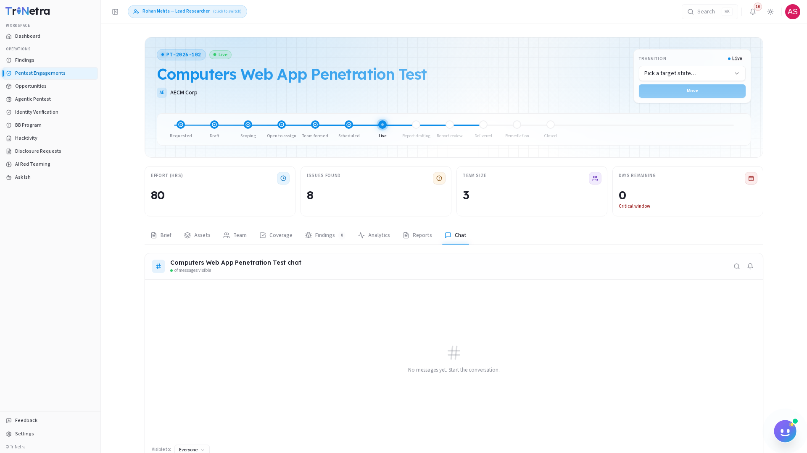

# Chat

The **Chat** tab is a secure, real-time messaging workspace built into the engagement detail page. It enables researchers to communicate directly with other testing team members, SecurityBoat project managers, and the client organization.

---

## Channels & Scope

The chat tab is structured as a multi-party group channel containing:

| Roster Party | Platform Role |
| :--- | :--- |
| **Testing Team** | Assigned Researchers and the Lead Researcher. |
| **SecurityBoat Management** | The assigned Technical Project Manager (TPM) and Customer Success Manager (CSM). |
| **Client Organization** | Client Administrators and Client TPMs. |

---

## When to Use Chat

The chat tab is the primary channel for operational communication during testing:

| Scenario | Objective |
| :--- | :--- |
| **Credential Blockers** | Ask the client to reset password locks or update expired accounts. |
| **IP Whitelisting** | Request that client system administrators whitelist testing IP addresses if firewall blocks occur. |
| **Scope Inquiries** | Ask for clarification on wildcard subdomains or testing endpoints. |
| **PoC Discussion** | Discuss reproduction steps or technical impacts with client developers. |

---

## Chat Best Practices

Please observe the following guidelines when using the chat:

| Guideline | Policy / Protocol |
| :--- | :--- |
| **No Finding Writeups** | Do not write complete vulnerability reports or paste exploit scripts in the chat. Use the **Submit Finding** drawer for reports. |
| **Keep it Centralized** | Avoid using external communication channels. Centralizing chat ensures all updates are recorded. |
| **Professionalism** | Maintain a constructive, professional tone at all times. |

---

← Previous: [Reports](reports.md) | Back to: [Engagements Overview](../overview.md)
