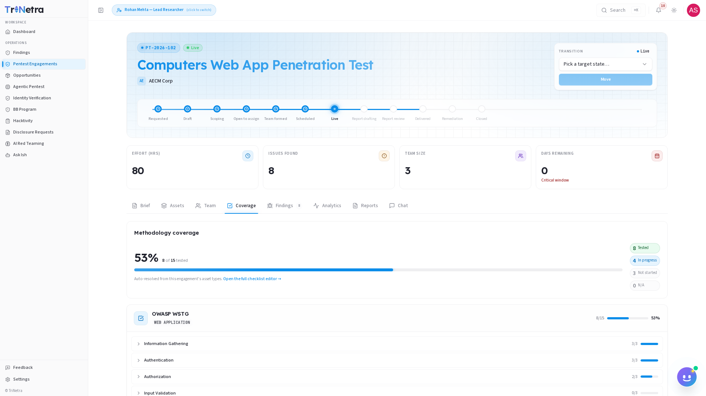
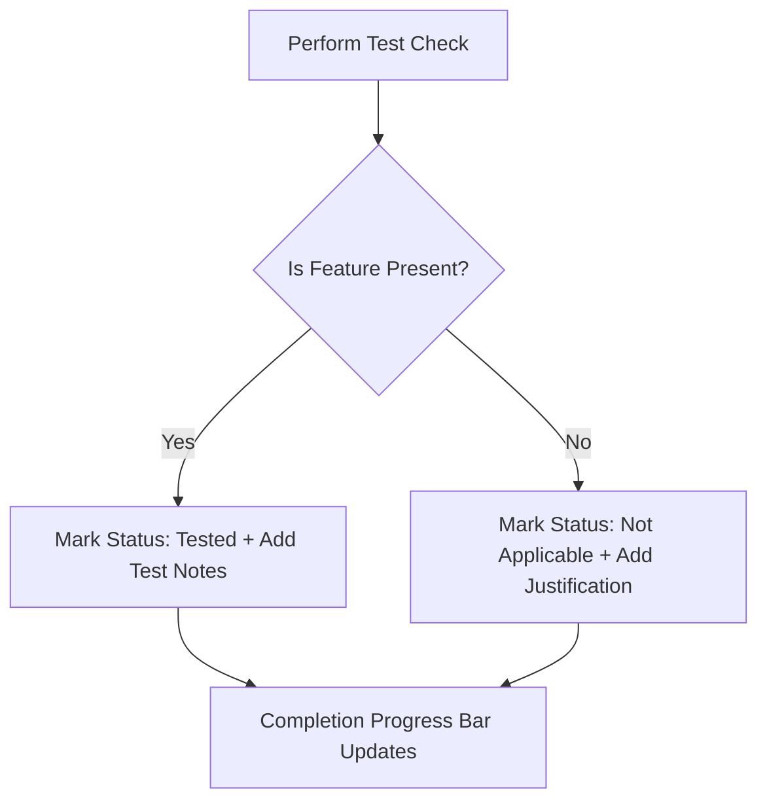

# Coverage

The **Coverage** tab is where the testing team tracks and documents the progress of the security assessment. It provides a structured methodology checklist based on the type of assets under review.

Completing the coverage checklist is a critical requirement of the penetration test. It demonstrates to the client that a thorough, systematic assessment was conducted, rather than just running automated scanners.

---

## Logging Coverage Workflow

The flowchart below illustrates the process for completing and logging a methodology checklist item:

---

## Methodology Checklists

The checklists are automatically populated based on the engagement type. Common frameworks include:

| Framework | Target Category |
| :--- | :--- |
| **OWASP Top 10** | Web Applications |
| **OWASP API Security Top 10** | APIs & Web Services |
| **OWASP MASVS** | Mobile Applications (iOS / Android) |
| **NIST SP 800-115** | Network Infrastructure & Servers |

---

## Recording Testing Coverage

During the **Live** phase, as you complete specific testing checks, you must document your progress:

1.  **Checkoff**: Mark the checkbox next to the completed testing item (e.g., *Verify password policy enforcement*).
2.  **Add Testing Context**: Configure the following fields in the checklist item drawer:

| Context Field | Requirement |
| :--- | :--- |
| **Status** | Mark as **Tested** (fully verified), **Not Applicable** (the feature is not present on the target), or **In Progress**. |
| **Assigned Tester** | Select your name from the assigned testers dropdown list. |
| **Notes** | Add a brief note detailing paths or parameters tested, tools used, or manual results (especially if marking as "Not Applicable"). |

---

## Collaborative Progress Tracking

The coverage tab features a visual progress bar indicating the overall completion percentage of the checklist.

*   **Real-time Updates**: Both the client organization and the SecurityBoat TPM can monitor the progress bar.
*   **Lead Researcher Review**: The Lead Researcher reviews the notes and ensures all checklist items are fully resolved before transitioning the engagement to the **Report Drafting** phase.

---

← Previous: [Team](team.md) | Next: [Findings →](findings.md)
