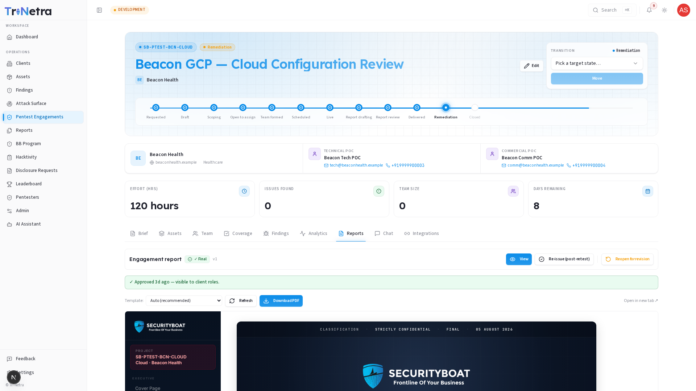
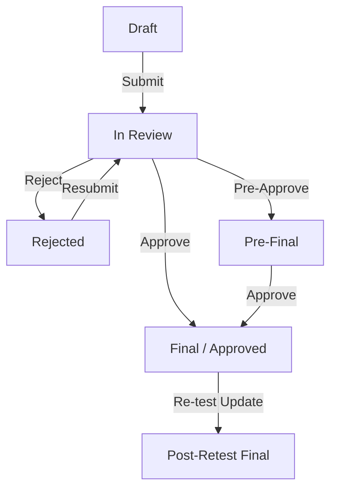
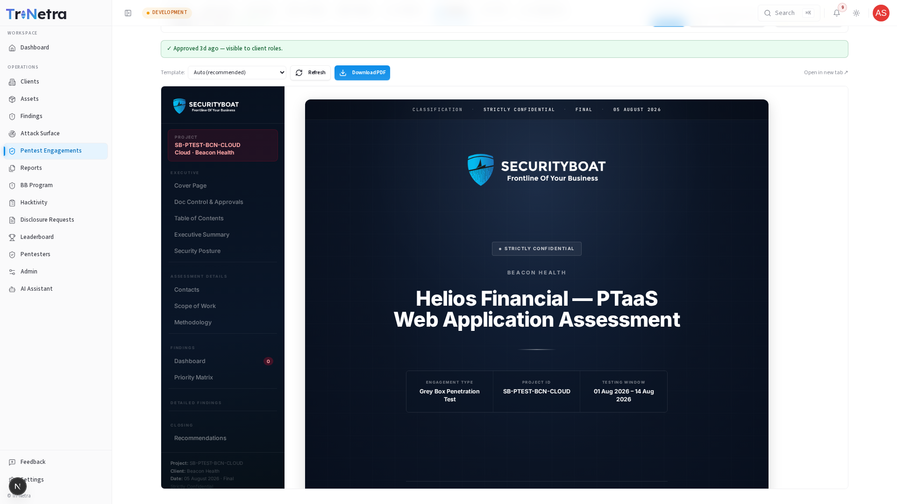

# Reports

The **Reports** tab is a secure, collaborative workspace on the engagement details page. It is visible to the **Lead Researcher**, **TPM**, **CSM**, **Platform Admin**, and **Client** roles.

!!! important "Role Restriction"
    Standard **Researchers** do not have access to this tab. Only the assigned **Lead Researcher** has authorization to author and submit the report narrative.

---

## Report Lifecycle Flow

Reports transition through a structured lifecycle to ensure rigorous review and segregation of duties. The diagram below shows the report approval flow:

---

## Role & State Permission Matrix

Access to view, edit, transition, or download reports is strictly controlled:

| Action | Allowed Roles | Preconditions / States |
| :--- | :--- | :--- |
| **View Preview** | Lead Researcher, TPM, CSM, Admin, Client | All states |
| **Edit Narrative & Scope** | Lead Researcher, TPM, CSM, Admin | Draft, Rejected |
| **Submit for Review** | Lead Researcher, Admin | Draft, Rejected (requires narrative content) |
| **Reject / Request Revision** | TPM, CSM, Admin | In Review, Pre-Final (requires revision note) |
| **Mark Pre-Final** | TPM, CSM, Admin | In Review |
| **Mark Final (Approve)** | TPM, CSM, Admin | In Review, Pre-Final |
| **Re-issue Post-Retest Final** | TPM, CSM, Admin | Approved |
| **Reopen for Revision** | Admin (Escape Hatch) | In Review, Pre-Final, Approved, Post-Retest Final (reverts to Draft, requires revision justification) |
| **Download PDF** | Admin, CSM, Client | Approved, Post-Retest Final (Lead Researcher is denied) |

---

## Editor Mode Narrative Sections

In edit mode, the author can configure the following narrative components using a rich-text editor:

| Section Field | Renders In | Content Guidelines |
| :--- | :--- | :--- |
| **Title** | Report Cover | Optional. Custom report title (defaults to engagement title if blank). |
| **Executive Summary** | Summary Section (Top) | One or two paragraphs summarizing what was tested, testing timeline, and headline outcomes. |
| **Executive Analysis** | Summary Section (Bottom) | Denser posture analysis detailing vulnerability trends, root causes, and strategic risk themes. |
| **Assessment Limitations** | Constraints Section | Optional. List of testing constraints (e.g. timeboxes, blocked credentials). Hidden if left empty. |
| **Summary of Recommendations** | Priority Recommendations | Structured list of top remediation priorities for the client engineering team. |

---

## Structured Scope Tables Editor

In addition to narrative text, the Lead Researcher maintains the **Scope Detail Tables**. These tables map target assets to their operational environments. Columns are fixed per asset type:

| Asset Type | Required Column Fields |
| :--- | :--- |
| **Web Application** | URL, Environment |
| **API / Web Services** | Base URL, Environment |
| **Mobile Application** | App Name/Binary, Bundle ID, Platform, Environment |
| **Cloud Infrastructure** | Account / Subscription ID, Region, Environment |
| **Thick Client** | App Name, Version, Environment |
| **IoT / Embedded** | Device Name, Firmware Version, Environment |
| **Other** | Name, Notes |

---

## Document Control & Auditing

*   **Description of Changes**: Every forward state transition (Submit, Pre-Final, Approve, Re-issue) requires the operator to input a description of changes. This note is saved directly to the version history and renders in the report's Document Control log.
*   **Administrator Reopen Log**: Reopening an approved report is an audit-logged event. It drops the report back to Draft (removing it from client view) and requires an administrative justification explanation, which is stored in the secure audit database.

---

← Previous: [Analytics](analytics.md) | Next: [Edit Narrative →](edit-narrative.md)
