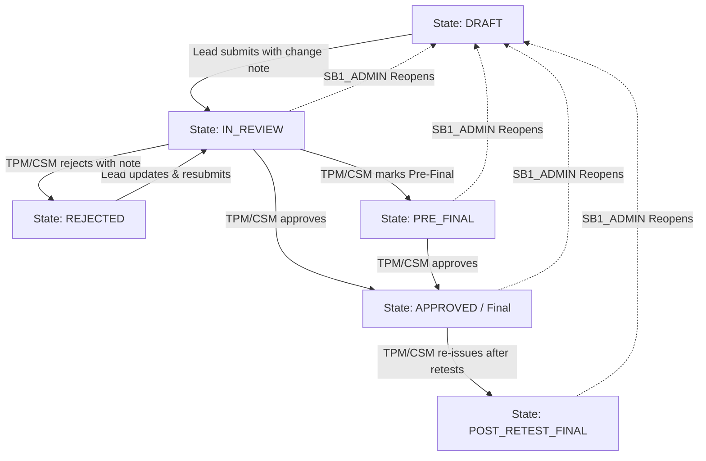

# Reports

The **Reports** tab is a secure, collaborative workspace on the engagement details page. It is visible to the **Lead Researcher**, **TPM**, **CSM**, **Admins**, and **Client** roles.

> [!IMPORTANT]
> **Role Restriction**: Standard **Researchers** do not have access to this tab. Only the assigned **Lead Researcher** has authorization to author and submit the report narrative.

---

## Report Lifecycle Flow

Reports transition through a structured lifecycle to ensure rigorous review and segregation of duties. The diagram below details the report state machine:

---

## Role & State Permission Matrix

Access to view, edit, transition, or download reports is strictly controlled:

| Action | Allowed Roles | Preconditions / States |
| :--- | :--- | :--- |
| **View Screen Preview** | Lead Researcher, TPM, CSM, Admins, Clients | All states |
| **Edit Narrative & Scope** | Lead Researcher, TPM, CSM, Admins | `DRAFT`, `REJECTED` |
| **Submit for Review** | Lead Researcher, Admins | `DRAFT`, `REJECTED` (requires non-null narrative) |
| **Reject / Request Revision** | TPM, CSM, Admins | `IN_REVIEW`, `PRE_FINAL` (requires note ≥10 chars) |
| **Mark Pre-Final** | TPM, CSM, Admins | `IN_REVIEW` |
| **Mark Final (Approve)** | TPM, CSM, Admins | `IN_REVIEW`, `PRE_FINAL` |
| **Re-issue Post-Retest Final** | TPM, CSM, Admins | `APPROVED` |
| **Reopen for Revision** | SB1_ADMIN (Escape Hatch) | `IN_REVIEW`, `PRE_FINAL`, `APPROVED`, `POST_RETEST_FINAL` (reverts to `DRAFT`, requires reason ≥20 chars) |
| **Download PDF** | Admins, CSM, Clients | `APPROVED`, `POST_RETEST_FINAL` (Lead Researcher is denied) |

---

## Editor Mode Narrative Sections

In **Edit narrative** mode, the author can configure the following narrative components using a rich-text Markdown editor:

| Section Field | Renders In | Content Guidelines |
| :--- | :--- | :--- |
| **Title** | Report Cover | Optional. Custom report title (defaults to engagement title if blank). |
| **Executive Summary** | Section 01 (Top) | One or two paragraphs summarizing what was tested, testing timeline, and headline outcomes. |
| **Executive Analysis** | Section 01 (Bottom) | Denser posture analysis detailing vulnerability trends, root causes, and strategic risk themes. |
| **Assessment Limitations** | Section 05 | Optional. List of testing constraints (e.g. timeboxes, blocked credentials). Hidden if left empty. |
| **Summary of Recommendations** | Section 02 | Structured list of top remediation priorities for the client engineering team. |

---

## Structured Scope Tables Editor

In addition to narrative text, the Lead Researcher maintains the **Scope Detail Tables** (Section 04). These tables map target assets to their operational environments. Columns are fixed per asset type:

| Asset Type | Required Column Fields |
| :--- | :--- |
| **Web Application** | URL, Environment |
| **API / Web Services** | Base URL, Environment |
| **Mobile Application** | App Name/Binary, Bundle ID, Platform (iOS/Android), Environment |
| **Cloud Infrastructure** | Account/Subscription ID, Region, Environment |
| **Thick Client** | App Name, Version, Environment |
| **IoT / Embedded** | Device Name, Firmware Version, Environment |
| **Other** | Name, Notes |

---

## Document Control & Auditing

*   **Description of Changes**: Every forward state transition (Submit, Pre-Final, Approve, Re-issue) requires the operator to input a description of changes (minimum 5 characters). This note is saved directly to the version history and renders in the report's Document Control log.
*   **SB1_ADMIN Reopen Log**: Reopening an approved report is an audit-logged event. It drops the report back to `DRAFT` (removing it from client view) and requires a justification note of at least 20 characters, which is stored in the 7-year regulatory audit database.

---

← Previous: [Analytics](analytics.md) | Next: [Chat →](chat.md)
