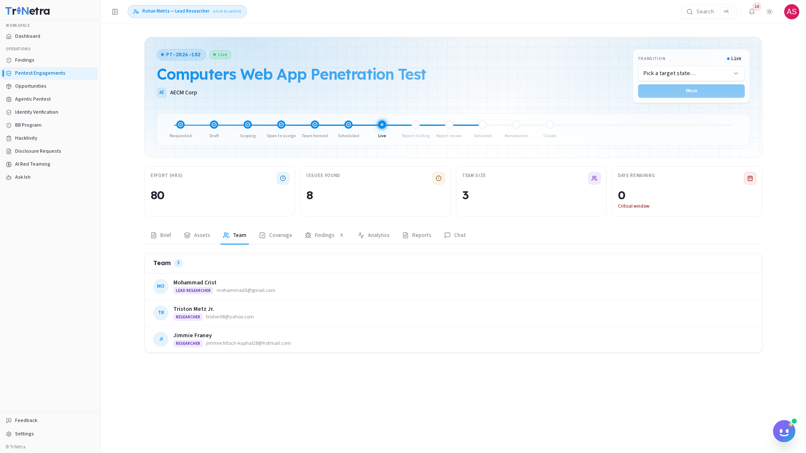
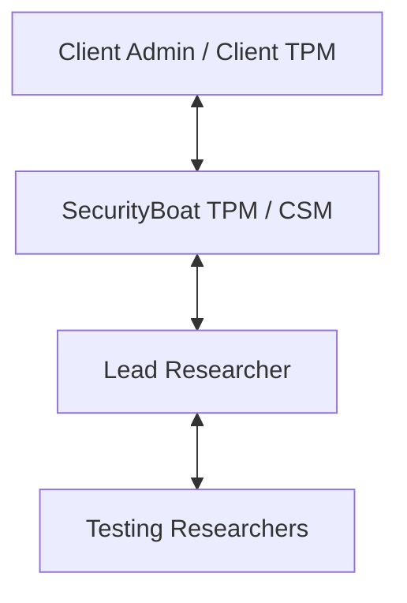

# Team

The **Team** tab lists the full security team roster assigned to the engagement, outlining who is participating from both the SecurityBoat side and the client organization.

---

## Communication & Collaboration Hierarchy

The hierarchy diagram below illustrates how communication flows during an engagement:

---

## Roster Classification

The team page classifies members by their role on the project:

### 1. SecurityBoat Testing Team

| Role | Responsibilities |
| :--- | :--- |
| **Lead Researcher** | The primary technical contact. Coordinates the testing team, reviews findings, ensures coverage checklist completion, and drafts the executive report. |
| **Researchers** | Security engineers responsible for identifying vulnerabilities, documenting coverage, and submitting findings. |

### 2. SecurityBoat Project Management

| Role | Responsibilities |
| :--- | :--- |
| **TPM (Technical Project Manager)** | Coordinates the project timeline, manages scheduling, and triages submitted findings. Serves as the escalation point for technical blockers. |
| **CSM (Customer Success Manager)** | Ensures overall client satisfaction and handles commercial or administrative questions. |

### 3. Client Team

| Role | Responsibilities |
| :--- | :--- |
| **Client Admin / Client TPM** | The client representatives who requested the pentest. They receive notifications, discuss findings in chat, and coordinate remediation. |

---

## Communication Protocols

!!! tip "For Technical Questions"
    Use the engagement **Chat** tab to discuss target behavior, credential errors, or testing blockages. This keeps the communications centralized and visible to both the testing team and the client.

*   **For Severity Queries**: If you have a question about how a finding is classified or need clarification on a duplicate triage state, message your assigned **TPM** or **Lead Researcher** directly.

---

← Previous: [Assets](assets.md) | Next: [Coverage →](coverage.md)
