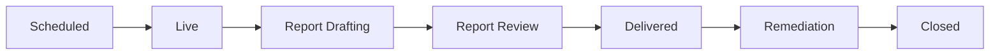

# Engagements Overview

Welcome to the **Pentest Engagements** module. This guide details how Penetration Testing as a Service (PTaaS) engagements operate on the Tri-Netra platform and explains the structured workflows researchers follow during a penetration test.

Unlike continuous Bug Bounty programs, a **PTaaS Engagement** is a scheduled, team-based security assessment with a defined target scope, specific testing timeline, and structured methodology.

---

## The Engagement Lifecycle

Engagements progress through a series of states. Knowing where an engagement stands helps you align your testing and reporting activities:

### Explanation of Lifecycle States

| State | What It Means for You |
| :--- | :--- |
| **Scheduled** | The engagement dates are locked. You can review the scope and brief, but testing has not started yet. |
| **Live** | Testing is actively underway. Perform security tests, collaborate in Chat, check off items on the Coverage checklist, and submit findings in real time. |
| **Report Drafting** | The testing window has closed. The security team (primarily the Lead Researcher) compiles and formats the final report. |
| **Report Review** | The compiled report undergoes peer review by SecurityBoat TPMs and QA staff. |
| **Delivered** | The final report has been issued to the client. |
| **Remediation** | The client is patching vulnerabilities. You may be requested to perform targeted retests on fixed assets. |
| **Closed** | The engagement is complete. Details are preserved as read-only. |

---

## Researcher Roles on Engagements

Your permissions and responsibilities depend on your assigned role:

*   **Lead Researcher**: Coordinates the pentest team, reviews finding submissions, monitors testing coverage, leads the report compilation, and communicates directly with SecurityBoat TPMs and CSMs.
*   **Researcher**: Performs security testing, documents coverage checkmarks, chats with the team, and submits findings.

---

## Navigating the Engagements List

To browse your assigned engagements, click **Pentest Engagements** in the main sidebar.

The listing page includes:
1.  **Summary Metrics**: Quick counters for Active Engagements, Open Findings, and Total Payouts.
2.  **Filter Pills**: Filter engagements by lifecycle states:
    *   **All**: Every engagement you are assigned to.
    *   **Active**: Engagements currently in progress (Scheduled through Report Review).
    *   **Live**: Engagements where active testing is underway.
    *   **Delivered**: Completed tests in remediation or delivery states.
    *   **Closed**: Finished engagements.
3.  **Search & Table**: Search by Project ID or title. The table lists the Project ID, Title, Client Organization, State, Assigned TPM, and Scheduled Dates.

> [!NOTE]
> Click on any row in the table to open the **Engagement Detail** view.

---

## Troubleshooting Engagement Access

| Issue | Cause / Solution |
| :--- | :--- |
| **An engagement is missing from my list** | You must be explicitly assigned to an engagement by a SecurityBoat administrator or invited via the **Invites** tab. Check for pending invites. |
| **Testing target does not respond** | If target servers are down or blocking your IP, report it immediately in the engagement **Chat** tab to alert the TPM and Client. |
| **Cannot submit a finding** | Ensure the engagement state is **Live**. Finding submissions are disabled once the testing window closes and the state transitions to Report Drafting. |

---

← Previous: [Invites](../05-invites.md) | Next: [Engagement Detail: Brief →](detail/brief.md)
