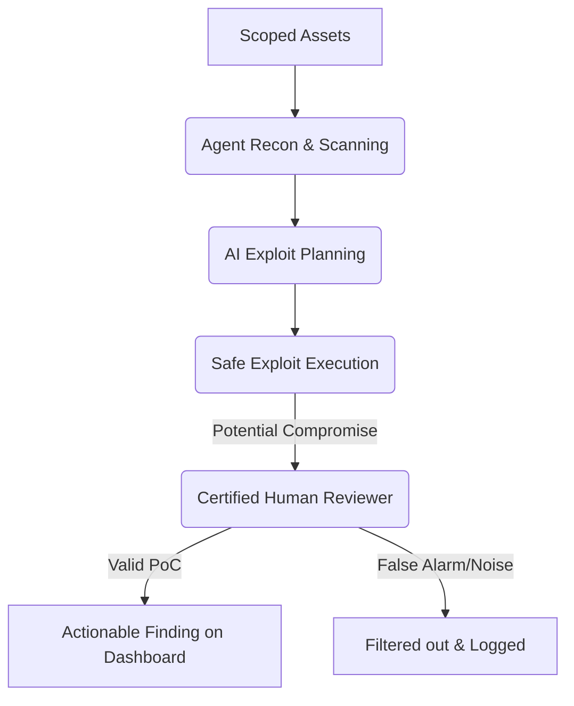

# Agentic Pentest

> **TriNetra · Offensive Testing** · Public product information

TriNetra's Agentic Pentest module harnesses autonomous AI agents to perform continuous reconnaissance and exploit-chaining under strict human oversight, delivering validated findings without the noise of typical scanners.

---

## What is Agentic Pentest?

Traditional vulnerability scanners look for signatures — matching versions or headers. They miss complex, multi-step vulnerabilities (e.g., using a public directory traversal to read a config file, extracting an internal service key, and using it to access private database endpoints). Conversely, traditional human-led pentests find these chains, but are restricted to point-in-time schedules.

Agentic Pentest combines the scalability of AI with the precision of human intelligence:

* **Autonomous Exploit Chaining:** Specialized AI agents act like virtual attackers, thinking in graphs rather than lists to chain minor flaws into real, high-impact compromises.
* **Human-in-the-Loop Signature:** An AI agent cannot publish a finding directly. A certified SecurityBoat analyst must review, reproduce, and sign off on every finding before it reaches your dashboard.
* **Zero False Positives:** Because human verification is mandatory, you receive proof of real reachability, not theoretical alerts.

---

## How it Works

The agentic pentesting lifecycle is designed to be continuous and safe, targeting only scoped assets.

### The Human Oversight Engine
SecurityBoat enforces a hard boundary between the autonomous agents and your security team:

* **The Agent Proposes:** The AI swarm maps the attack surface, plans payload execution, and runs non-destructive exploits.
* **The Human Confirms:** SecurityBoat's certified pentesters review the agent's work, verify the proof of concept, and add manual context.
* **The Platform Delivers:** The finding is populated on your dashboard carrying a "Human-Verified" badge.

---

## What We Provide

### 1. Multi-Step Exploit Chaining
Our agents simulate advanced threat actors by attempting to pivot across discovered services. They link low-severity issues (like informational disclosures or misconfigured CORS headers) to achieve critical outcomes (such as unauthorized API access or data exfiltration).

### 2. Live Proof of Concept (PoC) Traces
Every finding includes an interactive reasoning trace showing the step-by-step path the AI agent took, complete with request/response logs and payload examples. 

### 3. Continuous Execution
Unlike annual manual tests, agentic runs can be configured to run continuously or trigger automatically upon new releases, ensuring that code changes do not introduce critical exploit paths.

---

## Frequently Asked Questions

**Is it safe to run AI agents on production environments?**
Yes. Our AI agents are bounded by strict rule engines and execution guardrails. They are prohibited from executing destructive payloads (like deleting data or flooding networks). Additionally, we recommend running these tests on staging or pre-production environments when testing write-heavy business logic.
