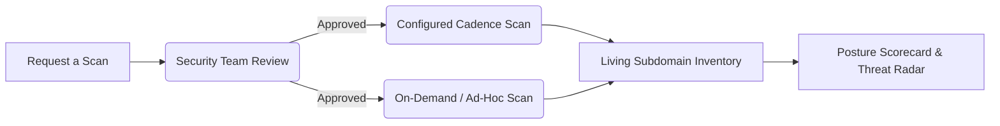

# Attack Surface Management (ASM)

> **TriNetra · Exposure & Risk** · Public product information

TriNetra's Attack Surface Management (ASM) module continuously discovers, inventories, and scores your organization's public internet footprint, ensuring that shadow IT, stale subdomains, and cloud assets are mapped and monitored.

---

## What is ASM?

Organizations routinely lose track of their internet-facing systems. Developers spin up staging environments, marketing teams register vanity domains, and subsidiaries deploy cloud applications without central IT oversight. These unmonitored assets are the first targets external attackers find.

TriNetra ASM solves this through controlled, continuous discovery:

* **Scope Confirmation First:** Unlike tools that scan blindly, ASM requires a target to be requested, reviewed, and approved before a scan runs.
* **Living Inventory:** Keeps a real-time record of your active infrastructure, replacing static, outdated spreadsheets.
* **Attributable Scans:** Every scan pipeline run has a clear, recorded trigger, eliminating mystery cron jobs or unexpected bandwidth consumption.

---

## How it Works

Onboarding and scanning follow a strict workflow to ensure authorization and scoping accuracy.

### The Request-and-Approve Flow
1. **Request a Scan:** Use the onboarding wizard to add targets by type:
    * **Standard Targets:** Root domains, IP ranges (CIDRs), or ASNs.
    * **Cloud Targets:** API integrations for AWS, GCP, Azure, or SaaS providers.
2. **Review & Approve:** SecurityBoat's operations team validates ownership and bounds to prevent accidental out-of-scope testing.
3. **Execution & Inventory:** Discovered assets populate the **Subdomains** inventory tab, listing open ports, detected technologies, TLS strength, and exposure scores.

---

## What We Provide

### 1. Exposure Scorecard
The ASM dashboard provides immediate visibility into your highest-risk exposure metrics:
* **Subdomain Takeovers:** Identifies subdomains pointing to orphaned cloud resources (e.g., deleted AWS S3 buckets or GitHub Pages) that attackers could hijack.
* **Exposed Login Portals:** Detects authentication endpoints (e.g., admin interfaces, databases, or Jenkins panels) open to the public.
* **Exposed Secrets:** Scans discovered web roots for exposed API keys, configuration files, or backup archives.
* **Weak TLS Hosts:** Identifies servers running obsolete encryption protocols (like SSLv3 or TLS 1.0) or expired certificates.

### 2. Living Subdomain Inventory
A searchable, tabular view of all assets under your footprint. Each row shows:
* Asset name and IP address.
* HTTP response code and titles.
* Detected software versions and frameworks.
* Threat level based on discovered exposures.

### 3. Integrated Scans Tab
The **Scans** tab displays every automated scan event, showing the start time, completion time, targets scanned, and the user or automated scheduler that triggered the execution.
