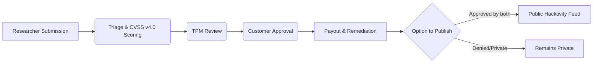

# Bug Bounty

> **TriNetra · Offensive Testing** · Public product information

TriNetra's Bug Bounty module allows organizations to launch public or private Vulnerability Disclosure Programs (VDPs) and rewarded Bug Bounty programs, leveraging a community of vetted security researchers to test systems continuously.

---

## What is Bug Bounty?

Legacy security assessments often run on a fixed schedule (such as a quarterly scanner or an annual pentest). Attackers, however, operate continuously, chaining minor vulnerabilities together and looking for complex business-logic flaws that standard scanners miss.

The Bug Bounty module bridges this gap by introducing continuous human-driven testing:

* **Pay-for-Impact Model:** You only pay for valid, unique, and in-scope findings, maximizing the return on your security budget.
* **Unified Triage Engine:** Every researcher submission runs through the same professional triage pipeline as our PTaaS engagements, scored strictly under CVSS v4.0.
* **Governed Disclosure:** A strict two-stage approval gate ensures nothing is disclosed publicly to the Hacktivity feed without explicit consent from both our Technical Program Manager (TPM) and your team.

---

## How it Works

A program functions as a living object inside the TriNetra platform, tracking from first researcher submission to verified fix and reward payout.

### The Two-Stage Approval Gate
To maintain security and prevent unauthorized leaks, any disclosure request must clear:
1. **TPM Review:** A SecurityBoat Technical Program Manager verifies the write-up, CVSS score, and reproducibility.
2. **Customer Approval:** Your team reviews the approved draft and gives final sign-off before the details are published.

---

## What We Provide

### 1. Program Types
* **Vulnerability Disclosure Program (VDP):** A points-only channel where good-faith researchers report findings for reputation points and hall-of-fame rankings rather than cash rewards.
* **Rewarded Bug Bounty Program:** Adds monetary rewards mapped to published per-severity tiers (P1 through P5). Programs can easily start as private VDPs and graduate to rewarded bounties as posture matures.

### 2. Standardized Reward Tiers
Programs leverage pre-published, transparent payout tiers aligned with threat severity:
* **P1 · Critical:** High-impact issues (e.g., SQL injection, remote code execution)
* **P2 · High:** Serious vulnerabilities (e.g., access control bypass, stored XSS on critical endpoints)
* **P3 · Medium:** Moderate findings (e.g., CSRF, sensitive info disclosure)
* **P4 · Low:** Minor configuration flaws
* **P5 · Info:** Educational or low-risk findings

### 3. Integrated Activity Console
Every finding has a dedicated activity log and direct chat between your team, the TriNetra triage team, and the researcher. This eliminates messy email threads and ensures all evidence remains on one governed record.
