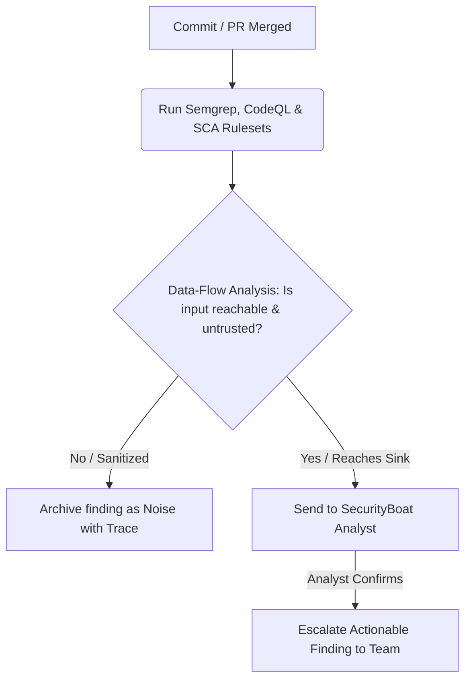
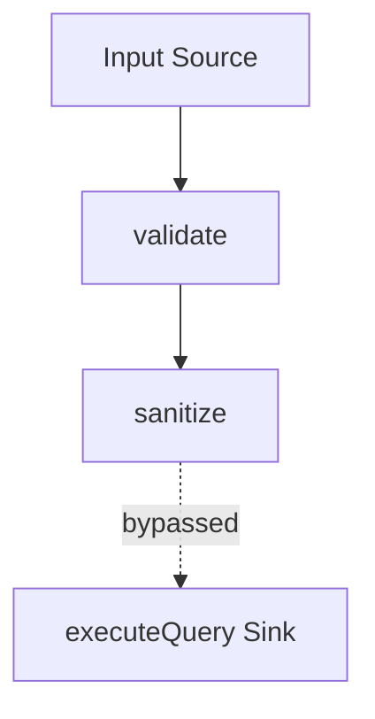

# Code Security

> **TriNetra · Offensive Testing** · Public product information

TriNetra's Code Security module integrates with your code repositories to analyze commits and pull requests, using data-flow reasoning to filter out tool noise and escalate only verifiable code injection paths.

---

## What is Code Security?

Traditional Static Application Security Testing (SAST) and Software Composition Analysis (SCA) tools flag every theoretical match of a pattern. When every alert is treated equally, developers spend hours triaging thousands of reports, causing critical, exploitable bugs to be missed.

Code Security changes the triage process:

* **Data-Flow Reasoning:** Instead of just flagging a vulnerability pattern, the engine traces the variables to see if user-controlled input can reach a dangerous function (sink) without passing through validation or sanitization functions.
* **The Shrinkage is the Product:** Reduces raw tool outputs by over 95%. For example, an active repository dashboard showing **1,204 raw findings** analyzed down to **6 human-escalated** issues.
* **Human-Confirmed:** Every escalated finding is verified by a SecurityBoat analyst before reaching your engineering team, ensuring that you only receive actionable bugs.

---

## How it Works

Code Security runs automatically within your Git workflow (GitHub, GitLab, Bitbucket) on every commit and PR.

### The Data-Flow Triage Engine
Rather than relying on basic string matching, our engine traces variable values through your codebase. Every escalated finding carries an interactive **Reasoning Trace** showing:
1. **Input (Source):** Where untrusted data enters the application (e.g., query parameters, request headers).
2. **Transformations:** Any validation or sanitization functions applied along the path.
3. **Bypass Analysis:** Verifies if sanitizers were bypassed or if a variable was missed.
4. **Sink:** The execution point (e.g., an SQL query, file operation, or system command).

---

## What We Provide

### 1. Interactive Data-Flow Traces
Each finding features a code-level visual path showing the journey of tainted input, making it easy for developers to understand *why* the vulnerability is exploitable:

### 2. SCA & Dependency Scanning
Integrated Software Composition Analysis monitors your third-party dependencies for known CVEs and license compliance, tracing whether vulnerable package code is actually imported and executed in your runtime path.

### 3. Clear Remediation Snippets
We don't just point out the problem; every escalated finding comes with secure code examples demonstrating how to properly sanitize or structure the code to close the vulnerability.
