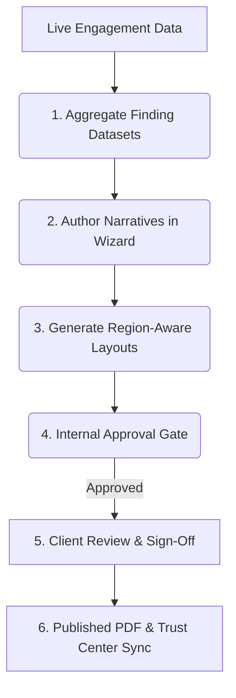

# Continuous Controls Validation (CCV)

> **TriNetra · Governance** · Public product information

TriNetra's Continuous Controls Validation (CCV) module aggregates live vulnerability data and engagement evidence to generate compliance-mapped reports for regulatory frameworks, ensuring audit readiness without manual document compilation.

---

## What is CCV?

Preparing for compliance audits is traditionally a manual, stressful process. When regulators or auditors request reports, security teams must search through past pentests, consolidate scattered findings, draft narrative summaries, and format the results to meet specific criteria. 

CCV automates this pipeline:

* **Live Data Aggregation:** Reports are compiled directly from live engagement datasets across PTaaS, ASM, DRP, and Code Security.
* **Region-Aware Rendering:** Generates specific, pre-formatted outputs for Indian and international frameworks (including RBI, SEBI, IRDAI, SOC 2, and ISO 27001).
* **Internal Approval Gating:** Ensures reports undergo a formal QA process and client review before they can be exported or shared.

---

## How it Works

CCV manages compliance reporting through a structured authoring and review lifecycle.

### The Document Lifecycle
1. **Aggregate:** Automatically imports verified findings, CVSS scores, remediation timelines, and testing scopes from your active engagements. 
2. **Author:** Guide developers and security leads through a wizard to complete executive summaries, exclusions, and management responses, with regulatory boilerplate pre-filled.
3. **Generate:** The rendering engine generates output matching your regulatory targets (e.g., standard CERT-In reporting sheets, SEBI CSCRF attestations, or SOC 2 Type II mapping grids).
4. **Approve:** Lock the document. It must be approved by an authorized manager before it can be exported, preventing unverified drafts from leaving the workspace.

---

## What We Provide

### 1. Supported Frameworks
CCV provides templates and mapping rules for key security frameworks:

* **SEBI Cyber Security & Cyber Resilience Framework (CSCRF):** Attestations and templates designed for Indian financial market intermediaries.
* **RBI Cyber Security Framework:** Annual and periodic assessments mapped to bank and non-bank financial institution requirements.
* **IRDAI Information Security Guidelines:** Reports structured for insurance providers.
* **SOC 2 Type II & ISO 27001:2022:** Maps pentest findings and asset inventories directly to specific Trust Services Criteria or Annex A controls.

### 2. Multi-Format Rendering Engine
Export reports in the layout required by your target audience:

* **Full Technical Reports:** Detailed breakdowns including proof of concepts and trace logs.
* **Executive Summary Reports:** High-level metrics, vulnerability counts, and sign-offs.
* **CERT-In Vulnerability Sheets:** The specific tabular structure required for reporting incidents and assessments to the Indian Computer Emergency Response Team.
* **Attestation Letters:** Branded, high-level summaries suitable for sales enablement and vendor reviews.

### 3. Unified Change-Request Loop
Clients and internal stakeholders can highlight text in the draft report and request edits or clarifications (e.g., updating a management comment or adjusting a remediation date). Edits are tracked in an audit log, firing notifications to reviewers until closed.
