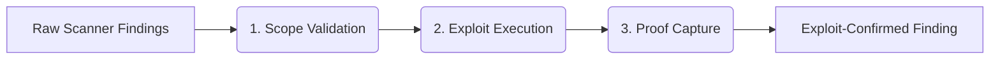

# Continuous Testing

> **TriNetra · Offensive Testing** · Public product information

TriNetra's Continuous Testing module integrates with your build pipeline to validate raw vulnerabilities at the speed of commits, using automated exploit validation to separate real risks from tool noise.

---

## What is Continuous Testing?

Security teams are routinely overwhelmed by the volume of alerts generated by traditional vulnerability scanners. When scanners flag thousands of "high-risk" vulnerabilities, sorting through the noise to find the few that are genuinely exposed takes too long. 

Continuous Testing acts as an exploit validation filter:

* **Proof-First Validation:** Instead of assuming a vulnerability is present based on a version number, the platform attempts to execute a safe exploit payload to verify the vulnerability is actually reachable.
* **Alert Funneling:** Shrinks thousands of raw scanner findings into a single-digit queue of confirmed exploits.
* **Commit-Triggered:** Runs automatically against staging and production endpoints as soon as new code is deployed.

---

## How it Works

Continuous Testing acts as the bridge between development commits and offensive validation, executing a three-stage pipeline.

### The Three-Stage Validation Pipeline
1. **Scope Validation:** Verifies if the target host is reachable, if the affected service is running, and if the path or endpoint is exposed to the public internet.
2. **Exploit Execution:** Launches controlled, safe exploit payloads designed specifically for the flagged CVE or vulnerability type to confirm if it can be successfully exploited.
3. **Proof Capture:** Captures concrete evidence (such as response headers, file read outputs, or screenshot proofs) of the successful compromise.

---

## What We Provide

### 1. The Vulnerability Funnel
Our interface shows the real-time conversion rate of your vulnerabilities. For example, a dashboard reading **1,240 raw indicators** processed down to **9 exploit-confirmed** findings. Your developers focus on the 9, and the remaining 1,231 are archived with their validation logs.

### 2. Live Proof Artifacts
Every validated finding carries a **Proof of Concept (PoC)** block containing the exact curl command, exploit payload, or response data captured during execution. This eliminates back-and-forth communication between security teams and developers.

### 3. Integrated Retesting
When a developer patches a vulnerability and merges the fix, the Continuous Testing pipeline automatically triggers a retest. If the exploit fails, the finding is moved to **Resolved** automatically on the dashboard, updating your compliance records.
