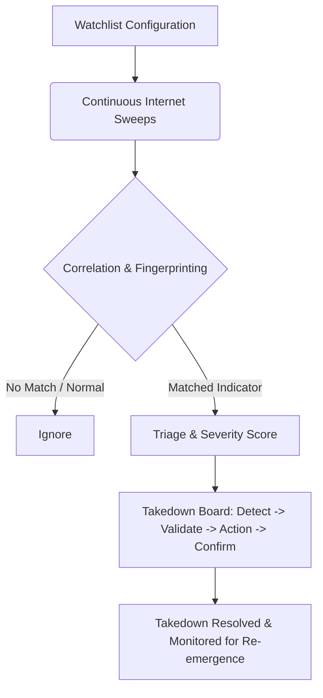

# Digital Risk Protection (DRP)

> **TriNetra · Exposure & Risk** · Public product information

TriNetra's Digital Risk Protection (DRP) module monitors the external internet landscape beyond your owned infrastructure, identifying brand impersonations, typosquats, leaked credentials, and phishing clones, and managing the takedown process.

---

## What is DRP?

An organization's security boundary does not end at its IP addresses. Attackers register lookalike domains, clone your web applications pixel-for-pixel to steal user credentials, post fraudulent mobile apps on mirror stores, and sell stolen employee credentials on leak sites. Because these assets are hosted on third-party infrastructure, standard scanners will never find them.

TriNetra DRP protects your brand's digital footprint:

* **Watchlist-Driven Monitoring:** Monitors for lookalike domains, brand keywords, product names, and executive names.
* **Kanban Takedown Tracking:** Tracks the lifecycle of a threat from detection through registrar notification to confirmed removal.
* **Evidence-Backed Alerts:** Every alert is accompanied by forensic evidence (such as HTML similarity scores, favicon hashes, and DNS histories) to justify action.

---

## How it Works

The DRP engine runs continuous sweeps across domain registries, app stores, leak forums, and search indexes.

### The Takedown Workflow
When a threat is confirmed, it is placed on a governed Kanban board to prevent stalled requests:

1. **Detect:** Initial discovery of the threat, populated with raw WHOIS and DNS data.
2. **Validate:** Enriched with visual proof (e.g., side-by-side screenshots) and technical signatures (e.g., HTML structure matches).
3. **Action:** A formal takedown request is filed with the hosting provider, registrar, or app store.
4. **Confirm:** The endpoint is verified as resolving to a parking page, showing a 404 error, or removed from the store.

---

## What We Provide

### 1. Seven Alert Categories
All external detections are classified into one of seven threat vectors:

* **Phishing Clone:** Identical or high-similarity replicas of your login interfaces hosted on external servers.
* **Typosquat / New Domain:** Lookalike domain names targeting your brand (e.g., swapping letters, adding dashes, or using obscure TLDs).
* **Financial Fraud:** Scam sites offering fake promotions, jobs, or products in your name.
* **Ransomware Leak Site:** Monitoring dark web leak sites for mentions of your brand or stolen datasets.
* **Credential Leak:** Scouring public repositories and leak dumps for compromised corporate email credentials.
* **Fake Mobile App:** Unauthorized mobile applications mimicking your software on third-party Android/iOS mirror sites.
* **Executive Impersonation:** Fraudulent social profiles (LinkedIn, X, Facebook) using your executives' names and images to target employees or clients.

### 2. Live Forensic Evidence
Every finding provides the data needed to file abuse reports:

* **Favicon Hash:** SHA256 signature of the site's icon, proving it was copied from your source.
* **HTML Similarity Score:** Numerical comparison of page structures.
* **DNS and WHOIS Trails:** IP hosting histories and registrar contact details.

### 3. Takedown Retesting
Even after a phishing site is taken down, DRP continues to monitor the hostname and IP for 30 days to ensure the attacker does not quietly restore service once the registrar complaint resolves.
