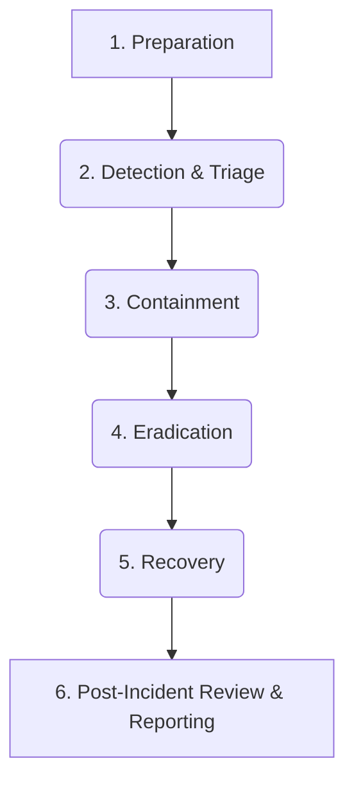

# Incident Response

> **SecurityBoat Managed Services** · Public product information

SecurityBoat's Incident Response (IR) service provides a dedicated, 24/7 technical team to contain, investigate, and recover from active cyber attacks, leveraging threat evidence from the TriNetra platform.

---

## What is Incident Response?

Active security incidents — whether a ransomware attack, a database breach, or a sophisticated financial fraud campaign — require immediate, decisive action. Organizations cannot afford to waste time onboarding external containment teams or searching for basic infrastructure logs when a breach is underway.

SecurityBoat's Incident Response service minimizes the impact of security incidents:

* **24/7 On-Call Experts:** A dedicated team of forensics analysts, malware handlers, and incident managers is ready to assist your team.
* **Warm-Start Response:** For clients running **DRP** and **ASM**, the IR team begins investigation immediately using existing asset logs and threat evidence, bypassing the slow environment-mapping phase.
* **Compliance-Aligned Closure:** Delivers formal post-mortems and files regulatory reports required by CERT-In, SEBI, RBI, or IRDAI.

---

## How it Works

We follow an industry-standard six-phase incident response process, customized to prioritize containment and evidence preservation.

### The Six-Phase Response Process
1. **Preparation:** Establish playbooks, set communication channels, and map critical assets before an incident occurs.
2. **Detection & Triage:** Identify indicators of compromise (IoCs). We check your **DRP** and **ASM** logs to trace root exposure points (e.g., matching a leaked credential to a public-facing admin panel).
3. **Containment:** Implement short-term measures to limit damage (e.g., shutting down network ports, revoking API keys, or blocking malicious domains) while preserving memory state and system logs.
4. **Eradication:** Find and remove the attacker's presence from your network, deleting backdoors, closing vulnerabilities, and cleaning compromised host images.
5. **Recovery:** Safely restore affected systems to production, verification of clean state, and implement enhanced logging.
6. **Post-Incident Review & Reporting:** Compile the incident report, outline lessons learned, and prepare files for regulatory compliance (e.g., submitting the 6-hour CERT-In breach notification).

---

## What We Provide

### 1. Retention Retainer or Ad-Hoc On-Call
We offer Incident Response retainers with guaranteed SLA response times (e.g., 2-hour technical support) or ad-hoc assistance for organizations facing an active compromise.

### 2. Digital Forensic Investigation
Our analysts conduct deep forensic analysis across endpoint images, cloud logs, and application events to reconstruct the attacker's timeline and identify what data was accessed or exfiltrated.

### 3. Regulatory Reporting Support
Financial and insurance institutions face strict breach-disclosure deadlines. We assist your compliance team by formatting technical findings to meet CERT-In, SEBI, RBI, and IRDAI reporting templates.

### 4. Integration with CCV & Trust Center
Once an incident is resolved, containment logs and post-mortem reports feed directly into your **Continuous Controls Validation (CCV)** database to update your compliance records, with summaries ready for publication in your **Trust Center** to rebuild stakeholder trust.
