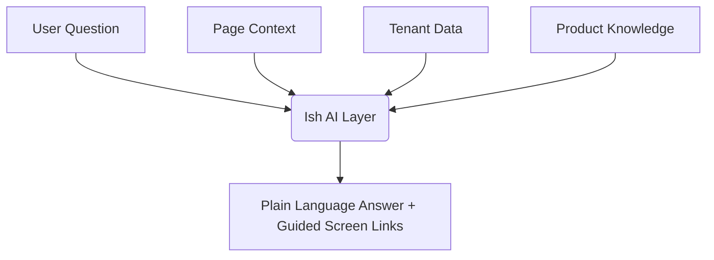

# Ish — Ask Anything

> **TriNetra** · Public product information

Ish is TriNetra's agentic AI assistant layer. It sits above all core modules, reading across your entire security posture to answer complex, high-level questions in plain language.

---

## What is Ish?

In a typical security setup, answering a simple question like *"Are we more exposed than we were last month?"* requires opening multiple dashboards, exporting spreadsheets (such as ASM targets, findings lists, and compliance readiness scores), and manually reconciling them. 

Ish solves this by providing a unified, conversational interface grounded directly in your live tenant data. 

* **Cross-Module Context:** Ish reads across **eight core modules** — Attack Surface Management (ASM), Digital Risk Protection (DRP), Bug Bounty, PTaaS, Continuous Testing, AI Red Teaming, Code Security, and Compliance.
* **Grounded in Reality:** Ish doesn't guess. It answers using live findings, active engagements, and generated reports scoped strictly to your organization.
* **Non-Actionable by Design:** To prevent unauthorized changes, Ish never runs commands, modifies code, creates tickets, or executes changes. It only answers questions and points your team to the exact dashboard screen needed to take action.

---

## How it Works

Ish resides in two places within the TriNetra interface:

1. **Dedicated Ask Ish Portal:** A full-screen conversational interface for deep-dive questions.
2. **Floating Dashboard Widget:** A persistent helper on every product screen that understands the active page context.

### Three-Layer Grounding Engine
Rather than relying on generic LLM knowledge, Ish constructs answers using three layers of context:

* **Your Tenant Data:** Live facts, vulnerabilities, scans, and assets from your account.
* **Product Knowledge:** Deep understanding of the TriNetra platform's structure, tools, and methodologies.
* **Page Context:** Awareness of exactly where you are in the application (e.g., viewing a specific finding or target) to tailor its responses.

---

## What We Provide

### 1. Cross-Module Correlated Answers
Ish can synthesize information across different disciplines. For example:

* **The Question:** *"Is anything impersonating our brand right now?"*
* **The Answer:** Ish queries **Digital Risk Protection (DRP)** and identifies active typosquats/clones, checks **Attack Surface Management (ASM)** to see if any point to your infrastructure, and tells you where the takedown requests stand.

### 2. Live Security Posture Summaries
Ask Ish to list your highest-priority issues, and it will return a list of actionable critical/high findings prioritized by reachability and compliance scope (e.g., pointing out a SQL injection first because it is in your active PCI DSS scope).

### 3. Model Transparency
Every answer generated by Ish carries a **Model Badge** and **Token Count** directly in the UI. This provides an honest, auditable trail showing which underlying model resolved your query, ensuring it is a verifiable reasoning layer rather than a black box.

---

## Frequently Asked Questions

**Can Ish automatically patch a vulnerability or close a ticket?**
No. Ish cannot execute changes on your behalf. If you ask Ish to fix something, it will explain the remediation steps and offer to open the relevant screen (e.g., your Jira integration or findings list) so your team can safely approve and manage the change.

**Is our data used to train public LLMs?**
No. All queries and tenant data analyzed by Ish are kept strictly isolated within your organization's secure tenant boundary.
