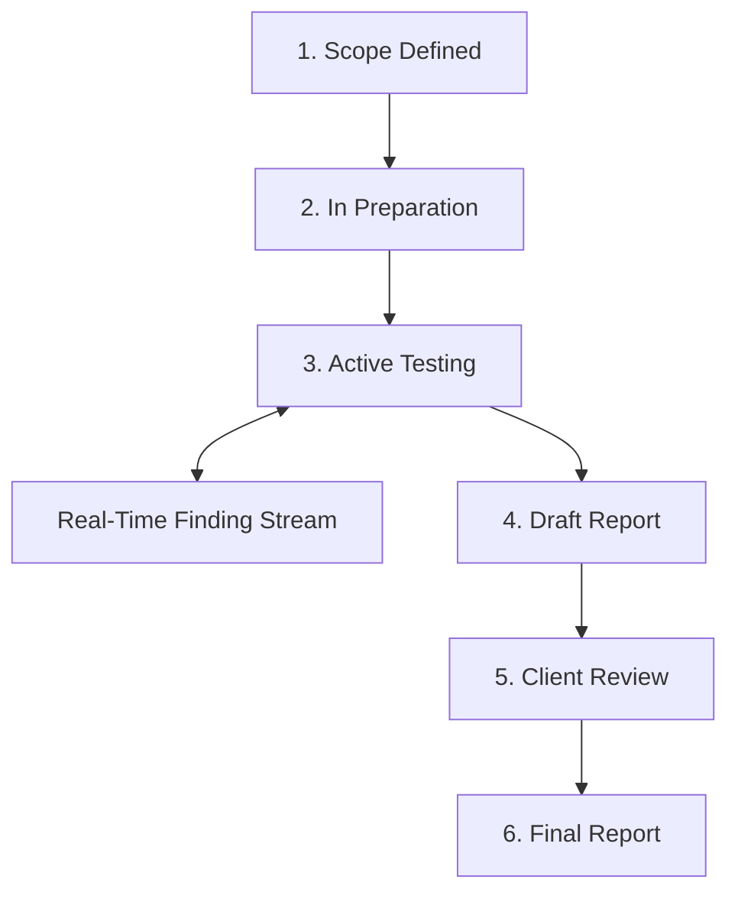

# PTaaS (Pentest as a Service)

> **TriNetra · Offensive Testing** · Public product information

TriNetra's PTaaS module moves traditional penetration testing away from static PDF deliverables and into a live, interactive dashboard, tracking engagements through a 12-state lifecycle.

---

## What is PTaaS?

Traditional pentests are treated as point-in-time projects. A testing firm scans your applications, manually checks for vulnerabilities, and compiles a PDF report. By the time you receive it, the code has changed, findings are out of date, and retesting a single fix requires scheduling a whole new engagement.

PTaaS redefines this model:

* **Continuous Visibility:** Monitor active testing as it happens, instead of waiting weeks for a final report.
* **12-State Engagement Lifecycle:** Every target, finding, and engagement progresses through clear, traceable workflow states.
* **Retesting Built-In:** Mark a finding as fixed, and the platform automatically alerts the testing team to validate and close the finding, maintaining a live record.

---

## How it Works

A PTaaS engagement is scoped using your live asset list from **Attack Surface Management (ASM)**. Once approved, the project transitions into active testing.

### The 12-State Lifecycle
The platform maps engagements, targets, and findings through 12 formal states to guarantee accountability:

```mermaid
graph LR
    S1[Scope Gained] --> S2[Setup Pending]
    S2 --> S3[Scheduled]
    S3 --> S4[Pre-Assessment]
    S4 --> S5[In Progress]
    S5 --> S6[Reporting]
    S6 --> S7[Quality Check]
    S7 --> S8[Draft Released]
    S8 --> S9[Final Released]
    S9 --> S10[Retest Pending]
    S10 --> S11[Retest In Progress]
    S11 --> S12[Closed]
```

| # | State | Description |
|---|-------|-------------|
| 1 | **Scope Gained** | Scope and targets defined. |
| 2 | **Setup Pending** | Awaiting credentials and configurations. |
| 3 | **Scheduled** | Assigned to testers and queued. |
| 4 | **Pre-Assessment** | Initial recon and scoping validation. |
| 5 | **In Progress** | Testers actively exploiting targets. |
| 6 | **Reporting** | Draft report being written by SecurityBoat leads. |
| 7 | **Quality Check** | Internal QA reviews finding evidence. |
| 8 | **Draft Released** | Released to you for feedback. |
| 9 | **Final Released** | Signed-off report issued. |
| 10 | **Retest Pending** | Remediation completed; awaiting validation. |
| 11 | **Retest In Progress** | Retesting the specific finding. |
| 12 | **Closed** | Finding verified as resolved or risk-accepted.

---

## What We Provide

### 1. Real-Time Findings Dashboard
As soon as a tester validates a finding, it is populated on your board with its CVSS v4.0 score, Proof of Concept (PoC) steps, and remediation advice. You do not have to wait for the engagement to end to start patching.

### 2. Direct Tester Chat
Every finding has a dedicated chat sidebar. If your developers need clarification on a PoC or want advice on a patch, they can chat directly with the researcher who found it, within the platform.

### 3. Integrated Retests
When a fix is deployed, your team clicks **Request Retest** on that specific finding. The platform assigns it back to the tester, who validates the fix and moves the finding to **Closed** or **Open (Failed Retest)** with updated proof.

### 4. Regulatory-Ready Exports
Export reports matching compliance frameworks like RBI Cyber Security, SEBI CSCRF, IRDAI, or CERT-In standards with a single click.
