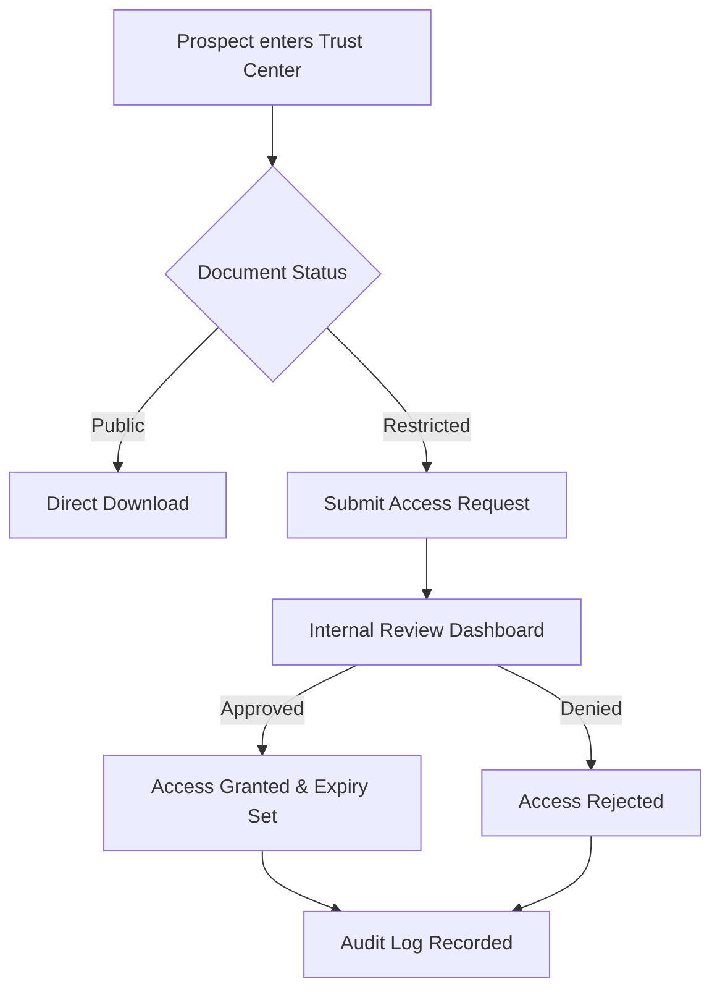

# Trust Center

> **TriNetra · Trust** · Public product information

TriNetra's Trust Center is a governed security portal and document library where customers, prospects, and auditors can access your pentest attestations, compliance certifications, and security policies under your control.

---

## What is Trust Center?

The security review is often the slowest stage of an enterprise sales cycle. Buyers request sensitive documents (like SOC 2 reports or penetration test summaries), which are then emailed manually. This results in no audit trail, stale files remaining in circulation, and zero visibility into who has access to your sensitive documentation.

Trust Center solves this by consolidating your security artifacts into a single portal:

* **Governed Access:** Public documents (like security overview briefs) are downloadable with one click, while sensitive files (like full SOC 2 reports) require a formal request.
* **Audit Trail:** Every access request, review, approval, and download is logged with a timestamp and IP, ensuring legal and compliance accountability.
* **Always Current:** Maintain a single source of truth for your active certificates, preventing outdated files from being circulated by sales teams.

---

## How it Works

The Trust Center functions as a public-facing portal linked to your organization's domain, backed by an admin console in TriNetra.

### The Request Lifecycle
1. **Centralize:** Organize documents into four standard directories: Compliance, Pentest Reports, Policies, and Certifications.
2. **Configure Visibility:** Choose whether a file is:
    * **Public:** Available to any visitor.
    * **Restricted (NDA Gated):** Requires the visitor to submit their email, company name, and reason for review.
3. **Approve:** Requests appear on the **Access Requests** board. Your security team reviews and approves or denies each request, setting a custom access expiry window (e.g., 7 days).
4. **Audit & Measure:** The platform records all downloads and tracks engagement analytics, showing which documents are queried most by prospects.

---

## What We Provide

### 1. Governed Document Library
Organize security documentation into four distinct sections:

* **Compliance Reports:** Attestations for SOC 2 Type II, ISO 27001 certificates, PCI DSS reports, and regulatory filings.
* **Pentest Reports:** Executive summaries and attestations generated directly from your **PTaaS** engagements.
* **Policies:** Public-facing summaries of your internal security controls, data retention policies, and sub-processor lists.
* **Certifications:** Official registration documents and empanelment letters.

### 2. Request Review Dashboard
A dedicated portal listing all pending requests with visitor details. For example:

* **User:** Arjun Mehta · Stealth Labs
* **Target:** Annual Penetration Test Summary
* **Reason:** *"Vendor risk assessment for Q3 pilot program"*
* **Status:** Click Approve to grant access or Deny to reject.

### 3. Integrated Audit Logs
Export full logs showing who requested which document, who approved it, when it was viewed, and what IP address downloaded the file. This provides compliance evidence for your own internal audits.
