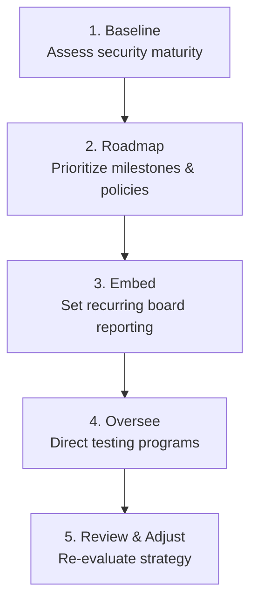

# vCISO as a Service

> **SecurityBoat Managed Services** · Public product information

SecurityBoat's virtual CISO (vCISO) service provides strategic security leadership, governance, risk management, and regulatory compliance direction, powered directly by the TriNetra platform.

---

## What is vCISO as a Service?

Hiring a full-time Chief Information Security Officer (CISO) is slow, expensive, and introduces a single point of failure if that person leaves. Furthermore, small and medium enterprises often need senior security direction but cannot justify the cost of a full-time executive.

Our vCISO service places a senior security leader on retainer, backed by SecurityBoat's entire technical bench:

* **Executive Security Leadership:** A named, senior security practitioner represents your security posture in executive and board-level meetings.
* **Platform-Driven Governance:** Rather than operating in isolation, your vCISO manages your security roadmap using the live dashboard data in TriNetra.
* **Empanelled Expertise:** Access specialists with experience delivering assessments for hundreds of financial institutions and enterprises.

---

## How it Works

A vCISO engagement progresses through five clear stages to establish governance and align with your business objectives.

### Strategic Integration Areas
Your vCISO takes ownership of three core security operations:

* **Governance, Risk & Compliance (GRC):** Drafting and updating security policies, maintaining an active risk register, and translating technical vulnerabilities into business risk metrics for executive leadership.
* **Offensive Program Design:** Deciding which assets are scanned by **ASM**, setting the testing cadence for **PTaaS** or **Agentic Pentesting**, and managing the scope of your **Bug Bounty** program.
* **Managed Response Direction:** Prioritizing vulnerability remediation schedules, reviewing third-party vendor risks, and managing escalations directly to the SecurityBoat **Incident Response** team if a threat arises.

---

## What We Provide

### 1. Named Senior Security Lead
You are assigned a principal security advisor as your primary contact. Your advisor is supported by SecurityBoat's analysts, threat hunters, and compliance experts, ensuring your guidance is never limited by one person's calendar.

### 2. Live Risk Register
We replace static risk spreadsheets with an interactive risk register inside TriNetra. Risks are mapped to technical findings, compliance controls, and assigned owners, making it easy to track remediation progress.

### 3. Board-Ready Reporting
Get executive-level slide decks and reporting dashboards that summarize your threat posture, compliance readiness (RBI, SEBI, IRDAI, SOC 2, ISO 27001), and program milestones in plain business language.

### 4. Vendor Risk Assessments
Ensure your third-party vendors meet your security standards. Your vCISO defines vendor assessment questionnaires, evaluates incoming reports, and highlights external risks.
